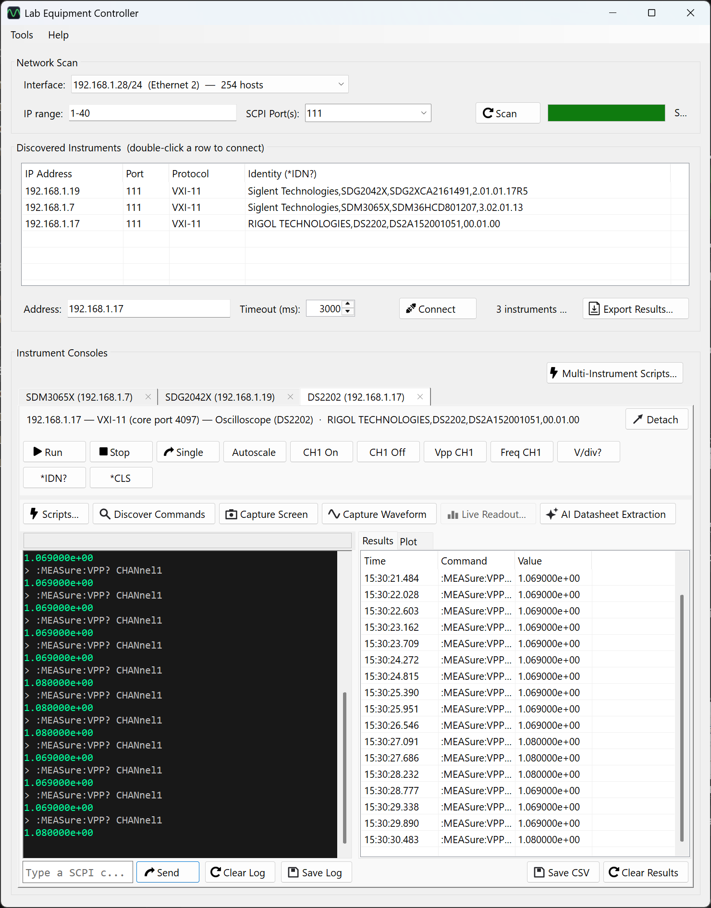
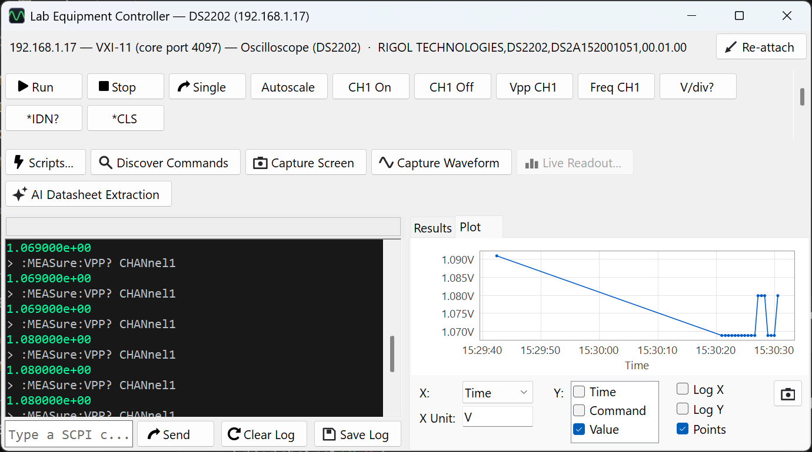
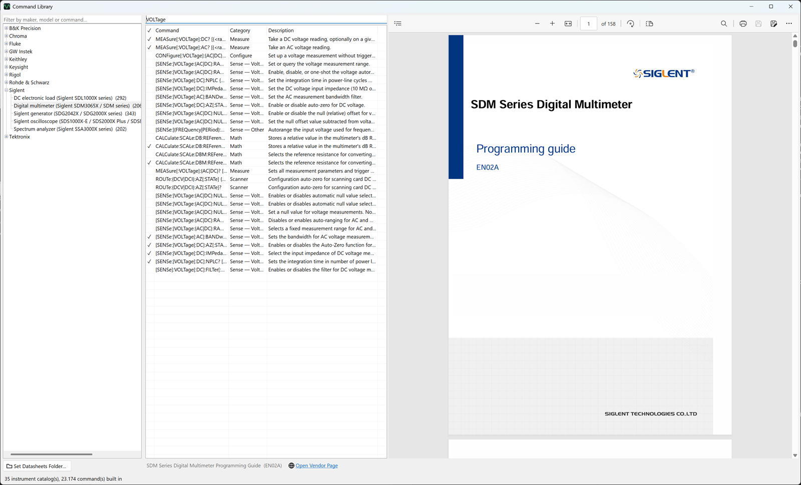
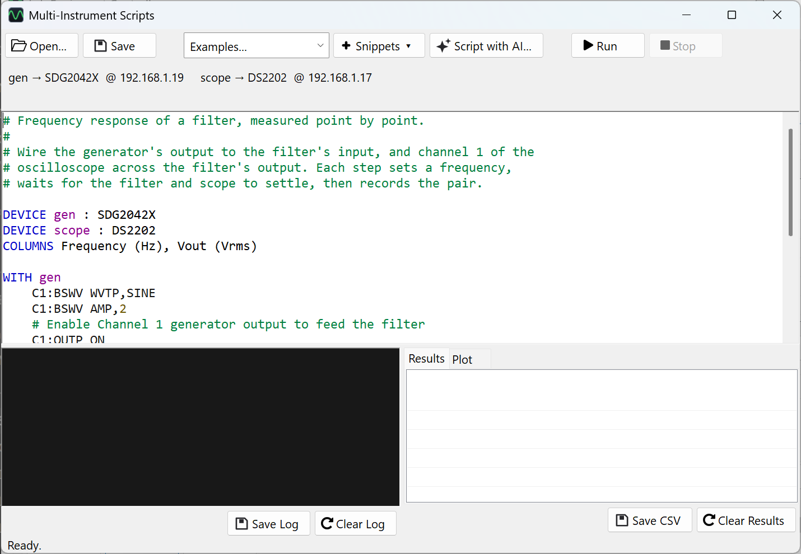
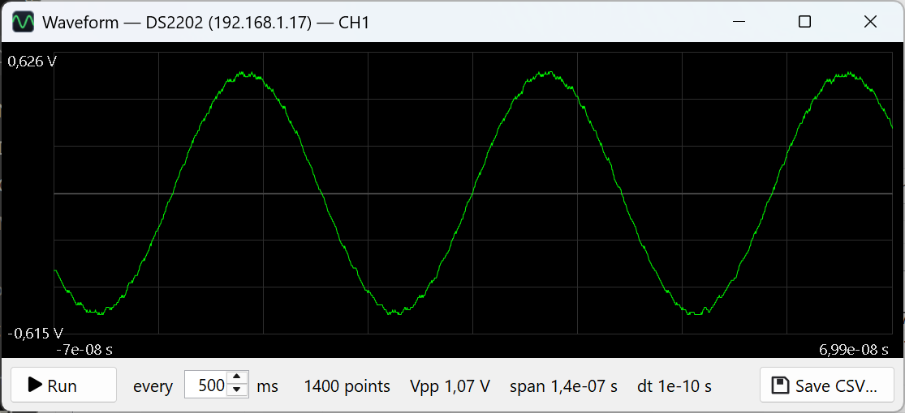

# Lab Equipment Controller

[](https://github.com/EECSB/LabEquipmentController/actions/workflows/ci.yml)
[](https://www.nuget.org/packages/LabEquipmentController)
[](LICENSE)

A Windows desktop app for discovering and controlling lab instruments (oscilloscopes,
function generators, …) over Ethernet using **SCPI**. It scans the local network, lists
the instruments it finds, and lets you connect to several at once and drive each one from
a command console, instrument-aware quick-command buttons, or a small scripting window.

Built with **C# / WinForms** targeting **.NET 10** (`net10.0-windows`).

How the pieces fit — the windows, the transport stack, the catalog pipeline and the
tests that hold them together — is in **[docs/ARCHITECTURE.md](docs/ARCHITECTURE.md)**.

## What it looks like

Every screenshot below is a real session against the bench this project is developed on —
a Rigol DS2202 oscilloscope, a Siglent SDG2042X generator and a Siglent SDM3065X
multimeter, all answering over VXI-11. Nothing is mocked up.

**Scan, then a console per instrument.** The sweep found all three; each opened its own
tab, and the quick-command row is built from that family's catalog rather than a fixed
list. Here the oscilloscope's tab is in front, being polled for peak-to-peak voltage — the
log carries every command and reply, and each numeric answer also lands in the results
table with a timestamp.



**Any tab detaches into its own window,** so instruments can be watched side by side. The
recorded readings plot as they arrive: pick which column runs across and which are drawn
up, switch either axis to log, and save the chart or the table.



**The command library** browses all 35 catalogs — 23,174 commands — by manufacturer, with
the vendor's own programming guide open beside them. A `✓` marks an entry confirmed on real
hardware; the filter here is showing the 206-command Siglent SDM catalog narrowed to
voltage commands, next to page 1 of the 158-page guide those entries were transcribed from.



**One script, several instruments.** `DEVICE` binds an alias to a model, the header shows
what each resolved to on this bench, and `WITH`/`FOR`/`RECORD` interleave the generator and
the scope inside one loop — which is the measurement a single-instrument script cannot
express.



**Waveform capture** pulls the trace off the scope and applies that vendor's own scaling to
turn raw bytes into volts and seconds — the part that is different for every manufacturer,
and where a wrong answer looks most like a right one. 1,400 points, 1.07 V peak-to-peak
across 140 ns, and **Run** re-reads it on an interval so the trace follows the instrument.



## Features

- **Network scan** — sweeps the selected interface's subnet on one or more SCPI ports and
  identifies responders via `*IDN?`. An **IP range** box narrows it to the part of the subnet
  your bench actually lives on — `192.168.1.20-60`, a bare `20-60`, a single address, a
  `/28` block, or any comma-separated mixture. Leave it empty to sweep everything.
- **Two transports** — raw TCP socket *and* a hand-rolled native **VXI-11** (ONC-RPC) client,
  for instruments that only speak VXI-11.
- **Several instruments at once** — each connection opens its own console tab, with its own
  log, history and tools. The scan and the discovered-instruments list stay shared above them.
- **Detachable consoles** — pull any tab out into its own window (its **Detach** button, or
  right-click the tab) to watch instruments side by side; closing that window puts the
  console back in a tab.
- **Command console** — type SCPI and see colour-coded replies; history with the arrow keys.
- **Instrument-aware quick commands** — the button set adapts to the connected instrument.
  Thirty-five families are recognised from `*IDN?`: Rigol, Tektronix, Keysight, Siglent,
  Rohde & Schwarz and GW Instek oscilloscopes; waveform generators (standard SCPI and
  Siglent's own dialect); Fluke, Keithley and generic multimeters; Keithley SourceMeter
  SMUs; Keysight, R&S, Chroma and generic DC power supplies; B&K, Chroma and generic
  electronic loads; and Siglent and R&S spectrum analyzers.
- **Scripting** — a script editor with a simple runner (`DELAY`, `REPEAT…END`, `PRINT`,
  comments) and a set of ready-made examples per instrument family.
- **Multi-instrument scripts** — one script driving several instruments, for measurements
  that need them to take turns. A swept filter response steps the generator, waits, reads
  the meter and records the pair, thirty or forty times over — then saves the table as CSV
  to plot. Lines are addressed by name (`gen:`, `dmm:`), instruments are bound by model so
  DHCP cannot break a saved script, and a line that does not say which instrument it is for
  is refused rather than guessed at. On the connect row, and under Tools.
- **The results, plotted** — the recorded table is drawn as a curve beside itself, redrawing
  as each row arrives. Pick which column runs across and which are drawn up; tick more than
  one to compare them on the same axes; switch either axis to log for a sweep that spans
  decades. The table is still what gets exported to CSV — this is for seeing whether the
  measurement worked before spending an afternoon on the numbers.
- **An editor that teaches the language** — the script language is this app's own, so both
  editors colour it as you type, complete keywords, aliases, captured values and catalog
  commands (Ctrl+Space), and carry a **Snippets** dropdown listing every construct with a
  description. Pick one — or type its short name and press Tab — and it is written in with
  its blanks selected, Tab stepping to the next.
- **Command reference** — a searchable, curated catalog of **23,174 SCPI commands**
  transcribed from vendor programming guides, with each entry marked as confirmed on the
  bench (`✓`), corroborated by an independent open-source driver (`•`), or from the guide
  alone.
- **Command library** — Help ▸ Command Library browses all 35 catalogs by manufacturer,
  filters by maker, model or command text, and links each one to the guide it came from.
  Point it at a folder of downloaded PDFs and clicking an instrument opens its guide in a
  third column, beside the commands it was transcribed from.
- **AI datasheet extraction** — bring your own AI provider (Anthropic, Google Gemini, or
  anything speaking OpenAI's `/chat/completions` — OpenRouter, Groq, Ollama, LM Studio)
  and read commands out of a datasheet the built-in catalogs do not cover: PDF,
  Word or plain text. Your key is stored encrypted for your Windows account and never
  leaves the machine except to the provider you chose. Everything a model produces is
  shown for review before it is saved, kept apart from the curated catalogs, and marked
  `◆` wherever it appears.
- **AI script writing** — **Script with AI…** in either editor turns a plain-English
  description into a script. The model is handed the command catalogs of the instruments
  involved, told to use nothing else, and — when you ask it to fix something — the last
  run's output, errors included. What comes back is a draft in a preview pane with any
  command header the catalog does not know flagged underneath; it reaches the editor when
  you press Use, and runs when you press Run.
- **Capture** — screen and waveform, for the scopes whose guides document how. Traces plot
  in a viewer and export to CSV.
- **Discover commands** — attempts `SYSTem:HELP:HEADers?` and falls back to the curated
  catalog for the instrument's family.
- **Export** — save the console log to a text file and the discovered-instruments list to CSV.
- **Help ▸ About** — version, runtime, and the catalog totals, all read at runtime rather
  than written down.
- **Remembers your setup** — last interface, port list, timeout, and window size are restored
  on the next run.
- **Return-to-local** on disconnect, so the instrument's front panel is usable again.

See [docs/SPEC.md](docs/SPEC.md) for what the app is specified to do — discovery and probing rules,
addressing, the scripting language, file formats, and the instrument-specific protocol
quirks the code has to respect.

## Requirements

- **Running the published build:** 64-bit Windows 10/11. Nothing else — the self-contained
  build bundles the .NET runtime.
- **Building from source:** the [.NET 10 SDK](https://dotnet.microsoft.com/download).

## Build & run

From the project folder:

```bash
dotnet run --project LabEquipmentController.csproj
```

Or open `LabEquipmentController.slnx` in Visual Studio 2022 (17.14 or later, for the XML solution format) and press F5.

**If the build fails with a file-lock error**, a previous `LabEquipmentController.exe` is
still running (Visual Studio also holds `Core.pdb`). Close it, or:

```bash
powershell -c "Get-Process LabEquipmentController -EA SilentlyContinue | Stop-Process -Force"
```

## Tests

The transport, protocol, scanner, scripting, settings, and export logic live in a UI-free
`Core` library covered by an xUnit suite:

```bash
dotnet test Tests\LabEquipmentController.Tests.csproj
```

## Publish a single-file executable

A self-contained, single-file profile for 64-bit Windows is included:

```bash
dotnet publish -p:PublishProfile=win-x64
```

The result is one `LabEquipmentController.exe` (~48 MB, runtime included) under
`bin/Release/publish/win-x64/`. It runs on a clean Windows machine with no .NET install.

For a much smaller, framework-dependent build (requires the .NET 10 Desktop Runtime on the
target machine) publish without self-containment instead:

```bash
dotnet publish -c Release -r win-x64 --self-contained false -p:PublishSingleFile=true
```

## The command line (`lec`) — Windows, Linux and macOS

The same Core library has a terminal front end, for benches without a desktop and for
scripting a measurement into CI or a cron job. It targets plain `net10.0` rather than
`net10.0-windows`, so unlike the GUI it runs anywhere .NET does.

```bash
dotnet run --project Cli/LabEquipmentController.Cli.csproj -- scan --range 192.168.1.20-60
```

| Command | What it does |
|---|---|
| `lec scan` | Sweep the subnet (or `--range`) and identify what answers |
| `lec interfaces` | List local interfaces worth scanning |
| `lec id <address>` | `*IDN?`, plus the family and catalog it resolves to |
| `lec send <address> <cmd>…` | Send commands; any containing `?` is read back |
| `lec run <address> <file>` | Run a `.scpi` script against one instrument |
| `lec seq <file> --device gen=…` | Run a multi-instrument `.seq` script |
| `lec watch <address> <query>…` | Poll on an interval, one CSV row per reading |
| `lec screenshot <address>` | Save the instrument's screen |
| `lec capture <address>` | Read a scope trace as CSV or SVG |
| `lec plot <csv-file>` | Draw a recorded CSV as an SVG chart |
| `lec catalog <text>` | Search all 35 catalogs, by syntax or description |
| `lec version` | Version, runtime, and the catalog totals |

Addresses take a bare host (raw socket on 5025), `host:port`, `vxi://host`, or a full VISA
resource string. `--json` and `--csv` make any result machine-readable, `--out <file>`
writes it to disk, and `--quiet` drops everything but the result. Exit codes are 0 for
success, 1 for a failure, 2 for a usage mistake — so `lec` composes into a shell script.

**Live readings.** `--stream` on `run` and `seq` sends each recorded row to stdout the
moment it happens, flushed, instead of printing a table when the script ends — so a
twenty-minute sweep is watchable for twenty minutes:

```bash
lec run 192.168.1.20 sweep.scpi --stream | tee live.csv
```

`lec watch` is the same idea without a script: poll one or more queries forever (or
`--count n` times) and emit a timestamped CSV row per reading.

```bash
lec watch 192.168.1.22 "MEASure:VOLTage:DC?" --every 500ms --out log.csv
```

**Pictures.** `lec screenshot` writes the instrument's own image bytes — the format is the
instrument's choice, so a Rigol sends BMP and a Tektronix set to PNG sends PNG, and the
file extension is corrected to match what actually arrived rather than what you named it.
Nothing is re-encoded: the only in-box converter is Windows-only, and a native imaging
dependency would cost this tool its portability.

**Plots** come out as SVG, for the same reason — it is text, it opens in any browser, it
scales, and it needs no library. `lec capture --svg` draws a scope trace, `--svg` on
`run`/`seq` draws whatever the script recorded, and `lec plot` draws a CSV recorded
earlier by any of them (or by the GUI).

Build a standalone binary for whichever machine will run it:

```bash
dotnet publish Cli/LabEquipmentController.Cli.csproj -c Release -r linux-x64 --self-contained false -p:PublishSingleFile=true
```

Swap `linux-x64` for `osx-arm64`, `osx-x64`, `win-x64` or `linux-arm64`. The result is a
single ~11 MB `lec` that needs the .NET 10 runtime; add `--self-contained true` for one
that needs nothing at all.

**On Linux and macOS, build the projects rather than the solution** — the solution
contains the WinForms app, which is Windows-only by nature:

```bash
dotnet build Cli/LabEquipmentController.Cli.csproj && dotnet test Tests/LabEquipmentController.Tests.csproj
```

## The web version (Blazor, in a container)

The same bench in a browser. `Web/` holds two projects: a Blazor WebAssembly client that is
only a UI, and an ASP.NET Core server that owns every socket. A browser cannot open a TCP
connection to port 5025 and never will, so **all instrument traffic happens on the server** —
the client asks over HTTP, and script output streams back over SignalR.

```bash
docker compose up --build     # then open http://localhost:8080
```

or, without Docker:

```bash
dotnet run --project Web/LabEquipmentController.Web
```

It reaches parity with the desktop app for everything that makes sense over a network:
scan and discovery, a console per instrument with that family's quick commands, the results
table and plot, the command library, single- and multi-instrument script runners with live
output, waveform and screen capture, and the two AI features.

**Discovery needs the container on your network.** Sweeping a subnet from inside Docker's
default bridge network scans the container's own private network and finds nothing, so the
compose file uses `network_mode: host`. That mode is **Linux-only** — on Docker Desktop for
Windows or macOS the engine runs in a VM, so "host" is the VM's network and not your
laptop's, and discovery will not see the bench. There, run the server directly with
`dotnet run` instead, or give the container its own address on the bench VLAN with macvlan.

**Two things differ from the desktop app by necessity.** Connections belong to the server,
not to a browser tab, so a sweep survives a refresh — and two people with the page open are
driving *one* bench, not two. And the AI key comes from server configuration
(`Ai__ApiKey`), which means it is one key shared by everyone who can reach the page; there
is no Windows DPAPI in a Linux container to hold a per-user one. Both are stated in the UI
rather than left to be discovered.

## Use the engine in your own project (NuGet)

The UI-free `Core` library is published as **`LabEquipmentController`** — the transports,
discovery, instrument identification, script runners, capture decoding and all 35 curated
catalogs, with no UI dependency and nothing Windows-only.

```bash
dotnet add package LabEquipmentController --prerelease
```

It is published as a **beta** (`1.0.0-beta.N`) while the shape of the public API settles —
prerelease versions need the `--prerelease` flag and do not show up in search by default.
The code behind it is what the app and CLI use daily; it is the naming that may still move.

```csharp
using LabEquipmentController;

using var client = new SerializedInstrumentClient(new ScpiClient("192.168.1.20", 5025));
await client.ConnectAsync();

string idn     = await client.QueryAsync("*IDN?");
var    family  = InstrumentProfile.FamilyForIdentity(idn);
var    catalog = CommandReference.ForFamily(family);   // 23,174 commands across 35 families
```

The package id drops the `.Core` suffix the assembly carries, so it does not read as a
.NET Core component; inside, the assembly is still `LabEquipmentController.Core.dll`.
Build it with:

```bash
dotnet pack Core\LabEquipmentController.Core.csproj -c Release
```

That produces `LabEquipmentController.<version>.nupkg` and a matching `.snupkg` of symbols
under `Core/bin/Release/`.

### Publishing (trusted publishing, no API key)

Releases are published by GitHub Actions using
[NuGet trusted publishing](https://learn.microsoft.com/en-us/nuget/nuget-org/trusted-publishing):
GitHub issues a short-lived signed OIDC token describing this repository and workflow,
nuget.org validates it against a registered policy and returns an API key that expires in
an hour. **No key is stored in this repository or in GitHub secrets.**

[`publish-nuget.yml`](.github/workflows/publish-nuget.yml) is **manual only** — run it from
the Actions tab and type the version. Nothing publishes on a commit, and there is
deliberately no release trigger: this library and the desktop app version independently, so
an app release tagged `v1.1.0` would otherwise publish library version 1.1.0 permanently
without anyone deciding to. The workflow runs the full suite before it packs, and pushes
with `--skip-duplicate` so a re-run is harmless.

It needs two one-time settings:

| Where | What |
|---|---|
| nuget.org → your username → **Trusted Publishing** | A policy with Repository Owner `EECSB`, Repository `LabEquipmentController`, Workflow File `publish-nuget.yml` (name only, no path), Environment empty |
| GitHub → Settings → Secrets and variables → Actions | `NUGET_USER` = your nuget.org **username**, not your email |

The policy is keyed to the workflow's *file name*, so renaming that file breaks publishing
until the policy is updated. A policy on a private repository stays "temporarily active"
for seven days and becomes permanent on the first successful publish — nuget.org needs the
repository and owner IDs that only arrive inside a real token, which is what stops someone
deleting the repo and recreating it under the same name to publish as you.

## Continuous integration

[`ci.yml`](.github/workflows/ci.yml) builds and tests on **Ubuntu, Windows and macOS** for
every push and pull request. The whole solution is built on Windows; elsewhere the
portable projects are, because the WinForms app is Windows-only. Each platform then
actually runs `lec` — version, a catalog search, a plot — which is the only way the
cross-platform claim gets checked rather than assumed, and packs the NuGet package so a
broken package surfaces long before a release. The Node toolchain tests run too.

## Build the installer

The [releases page](https://github.com/EECSB/LabEquipmentController/releases) offers both
shapes: a **portable zip** carrying the self-contained build (~46 MB, runs anywhere), and
a **setup.exe** carrying the framework-dependent one (~4 MB, wants the .NET 10 Desktop
Runtime and offers to fetch it if missing). The installer is
[Inno Setup 6](https://jrsoftware.org/isinfo.php); its script lives in `installer/`.

Publish the framework-dependent payload into the directory the script expects, then
compile it:

```bash
dotnet publish LabEquipmentController.csproj -c Release -r win-x64 --self-contained false -p:PublishSingleFile=true -p:PublishDir=bin\Release\publish\win-x64-fd\
```

```bash
"%LOCALAPPDATA%\Programs\Inno Setup 6\ISCC.exe" installer\LabEquipmentController.iss
```

The result is `bin\LabEquipmentController-v<version>-setup.exe`. It installs per-user into
`%LocalAppData%\Programs` with no UAC prompt (the app needs no administrator rights); the
wizard offers a machine-wide install, and `/ALLUSERS` does the same from the command line.
Verify a build end to end — install, launch, uninstall — with:

```bash
powershell -ExecutionPolicy Bypass -File installer\Test-Installer.ps1
```

## Project layout

| Path | What |
|------|------|
| `MainForm.cs` | Main window: scan, discovered instruments, and the console tabs |
| `InstrumentConsole.cs`, `InstrumentWindow.cs` | One console per instrument, and its detached-window host |
| `ScriptForm.cs` | Script editor, one instrument |
| `SequenceForm.cs` | Multi-Instrument Scripts editor, several instruments at once |
| `ResultPlotPanel.cs` | The results plot and its axis pickers |
| `ScriptEditor.cs`, `SnippetMenu.cs` | The coloured editor with completion, and the Snippets menu |
| `ScriptAiForm.cs` | Script with AI — the request, the draft, and the catalog check on it |
| `AppIcons.cs`, `ButtonStyle.cs` | Button glyphs, and the metrics every button is built with |
| `AboutForm.cs` | The About box, opened from Help ▸ About |
| `Core/` | UI-free logic: transports, scanner, profiles, scripting, settings, export |
| `Core/CommandData/` | The curated SCPI catalogs, embedded as `commands.<family>.json` |
| `Tests/` | xUnit tests against a fake instrument |
| `Tests/Bench/` | Tests that talk to the real instruments, off unless `LEC_BENCH=1` — see its [README](Tests/Bench/README.md) |
| `Cli/` | The `lec` command-line front end — same Core, no UI, runs on Windows/Linux/macOS |
| `Web/` | The Blazor version: `…Web` is the server that owns the sockets, `…Web.Client` is the browser UI |
| `installer/` | Inno Setup script for the setup.exe, and its end-to-end smoke test |
| `tools/scpi-extract/` | Node pipeline that turns a vendor PDF guide into a catalog (not part of the build) |
| `docs/ARCHITECTURE.md` | How the pieces fit: system diagrams, the pipeline, per-component internals |
| `docs/SPEC.md` | What the app is specified to do — the document the tests are written against |
| `datasheets/` | Where the app looks for the vendor guides, alongside the pages and forum threads archived while hunting for them — the two indexes are committed, the guides and pages are not |
| `Assets/icons/` | Button glyphs, embedded into the executable |

Settings are stored per-user at `%AppData%\LabEquipmentController\settings.json`.

## Reaching the instruments from a VM

If you run this inside a **Hyper-V guest**, the Default Switch (NAT) cannot see a bench
subnet and cannot be bridged. Create an **External** switch on the host, bound to the NIC
that is on the instrument network, and attach it to the VM as a second adapter — the guest
keeps its NAT internet on the first adapter and gains the lab on the second. On the host,
as Administrator:

```powershell
New-VMSwitch -Name 'Lab-LAN' -NetAdapterName 'Ethernet 3' -AllowManagementOS $true
Add-VMNetworkAdapter -VMName '<your-vm>' -Name 'Lab' -SwitchName 'Lab-LAN'
```

Substitute the adapter name from `Get-NetAdapter -Physical`. Creating the switch briefly
interrupts that NIC. A DHCP address then re-leases onto a new `vEthernet (Lab-LAN)` adapter
on the host; a static one may need re-applying.

Note that the app restores the **last used** interface (see *Remembers your setup*), which
may still be the NAT adapter — pick the instrument subnet in the Interface dropdown before
scanning.

## Verified instruments

I personally only own the **Rigol DS2202 oscilloscope**, the **Siglent SDG2042X function
generator** and the **Siglent SDM3065X multimeter**, so I could verify the commands on real
hardware only for those 3.

| Instrument | Transport | Notes | Contributed by |
|------------|-----------|-------|----------------|
| Rigol DS2202 oscilloscope | **VXI-11** | Its raw-socket port has a firmware quirk (replies lag by one query), so the app prefers VXI-11 for it. | EECSB |
| Siglent SDG2042X function generator | **VXI-11 only** | It exposes no raw SCPI socket at all. | EECSB |
| Siglent SDM3065X multimeter | **VXI-11** | Answers on the portmapper (111) like the other two. | EECSB |

## Contributing

Three instruments sit on this bench, so 518 of the 23,174 catalogued commands carry a bench
tick and the other 22,656 have only ever been read in a vendor guide. Thirty-two of the
thirty-five catalogs have never touched hardware at all. **If you own one of those
instruments, you can help to add or verify the commands and functions.**

> **[docs/VERIFYING-COMMANDS.md](docs/VERIFYING-COMMANDS.md)** — how to confirm commands
> against your own instrument and send them back.

It is written to be handed to an AI coding agent: point one at that file and your
instrument's address and it has the protocol, the safety rules, the JSON shape and the tests
your PR has to pass. It reads the same way for a person working by hand.

The short version, and the part that is not negotiable:

- **Never invent SCPI** ([docs/SPEC.md](docs/SPEC.md) §10). Commands come from the vendor's programming
  guide for that instrument — not a forum, not another vendor's guide, not a plausible guess.
- **Accepted is not verified.** A setting counts when its query reads back what you set, or
  the panel visibly changes. Read the error queue after every command; instruments ignore
  unknown commands silently.
- **Do not fix a vendor's typo.** Transcribe it as printed and flag it with a
  `guideMisprint` note. Forty-one entries carry one today.
- **Mind what you send.** These commands drive real equipment — disconnect the DUT, and
  leave calibration and password subsystems alone.
- **Put your name on it.** Add your instrument to the Verified instruments table above, with
  your handle in the **Contributed by** column. A bench tick with nobody behind it is the one
  kind of unattributed claim this project would otherwise be full of.

Corrections count as much as additions. A catalogued command that your instrument rejects is
worth a PR on its own; include the model, the firmware version and the error it gave.

## Known limitations

- The **Rigol DS2202's** older firmware can wedge if it receives many rapid connections; give
  it a moment between connects, and power-cycle it if its front panel stops responding. For
  the same reason the app allows only **one console per address** — connecting to an
  instrument that already has one just brings its console to the front.
- Console tabs cannot be **dragged** out of the tab strip; use the tab's Detach button or
  its right-click menu.
- Open tabs are **not** restored on the next run. The instruments are on DHCP and their
  addresses move, so reconnecting on launch would be guesswork.
- **Discover Commands** relies on `SYSTem:HELP:HEADers?`, which neither verified instrument
  implements — it falls back to the curated catalog for that instrument's family.
- **Only the Rigol oscilloscope, Siglent generator and multimeter catalogs have been used
  against real hardware**, and only in part: 518 of 23,174 entries carry a bench tick. The
  other thirty-two families are transcribed from vendor guides and cross-checked against
  open-source drivers, but no such instrument has been on this bench. Treat them as
  documented, not proven. [Tests/Bench](Tests/Bench) holds the suite that verifies the three
  that are here — 624 catalog queries plus the capture, readout and transport paths — and
  records the other eighteen as having no instrument rather than as work outstanding.
- **Waveform capture works for Rigol, Keysight, Tektronix, R&S and Siglent scopes**, each
  in its own dialect: Tektronix reads `CURVe?` against the `WFMOutpre` fields, R&S reads
  `CHANnel<m>:DATA?` in ASCII and gets volts back directly, Siglent's `:WAVeform:PREamble?`
  is a packed binary descriptor read at documented byte offsets, and Keysight shares Rigol's
  ten preamble fields but not its arithmetic — `((data - yreference) * yincrement) + yorigin`
  against Rigol's `(data - yreference - yorigin) * yincrement`. Only the decoders are
  verified, against each vendor's own worked example; none has run against that instrument.
- **GW Instek scopes get neither capture.** `:COPY` writes the screen to a flash disk or
  printer rather than back over the wire, and while `:ACQuire<X>:MEMory?` does return
  samples, the GDS-2000 manual never says how a stored code becomes a voltage. That needs a
  constant nobody has written down, and a trace drawn against a guessed vertical scale looks
  entirely convincing while being wrong by an unknown factor.
- **Screen capture works for Rigol, Keysight, Tektronix, R&S and Siglent scopes, and for
  all three R&S analyzers.** The FPC returns a JPG from a single query; the FSL and FSV
  have no such command and instead write a PNG to their own mass memory and read the file
  back, which is the sequence both manuals document.
- **First-generation Siglent scopes** (SDS1000CML/DL, early SDS2000X) take an older
  LeCroy-derived dialect — `C1:VDIV`, `TDIV`, `TRMD` — that the catalog does not cover.
  They connect and work from the command line, but get no quick commands.
- **A Chroma 63800 and the older R&S analyzers (FSU, FSP, FSQ) get no quick commands.**
  Each used to be handed a different vendor's catalog that partly worked, which is worse
  than none: the buttons appeared, some even succeeded, and the failures looked like the
  instrument's fault. Every line with a guide reachable from here now has a catalog
  transcribed from that guide. The B&K 9130B was one of these until its programming manual
  turned up — it now has its own catalog, with the guide's misprints flagged rather than
  corrected (see [datasheets/ARCHIVED-PAGES.md](datasheets/ARCHIVED-PAGES.md)) — and the
  R&S FSW was the last, transcribed from the User Manual that R&S's own CDN serves.
- **A Keithley 2450 or DMM6500 may be in TSP mode**, where it answers none of its SCPI
  catalog. Send `*LANG SCPI` and power-cycle it; `*LANG?` reports the current setting.

## Licence

MIT — see [LICENSE](LICENSE). Use it, change it, ship it in something commercial; keep the
copyright notice.

One thing the licence does not cover, because it is not this project's to give: the
**vendor programming guides** the catalogs were transcribed from. Those are the
manufacturers' documents, free to download and not free to redistribute, which is why
`datasheets/` holds an index rather than the PDFs. The catalog entries themselves — a
command, its description, and which guide it came from — are this project's work and are
MIT along with everything else.