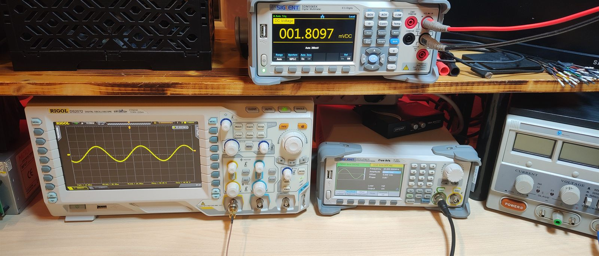
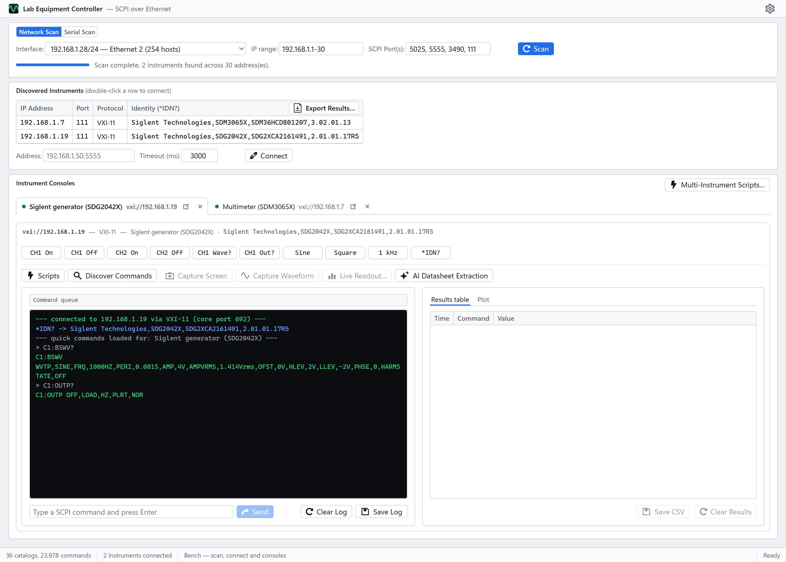
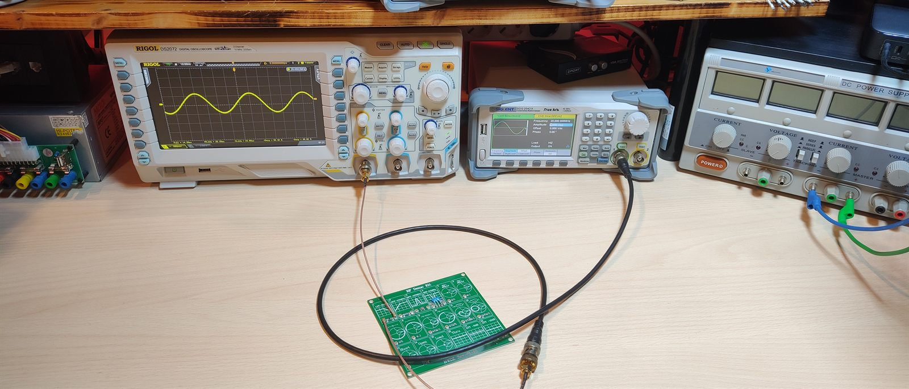
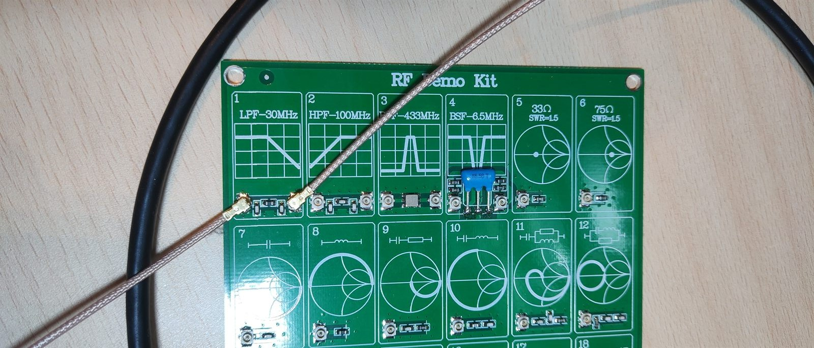
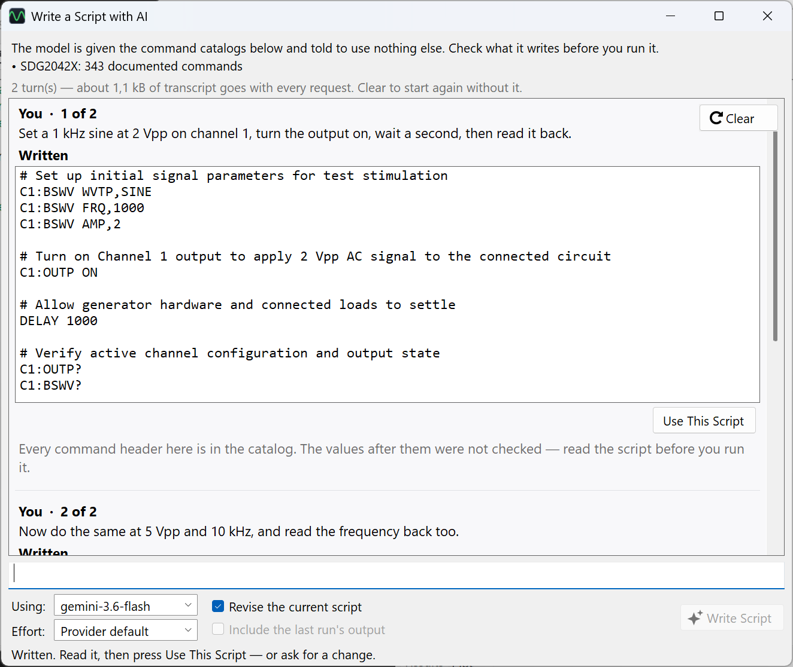

# Lab Equipment Controller

[](https://github.com/EECSB/LabEquipmentController/actions/workflows/ci.yml)
[](https://www.nuget.org/packages/LabEquipmentController)
[](https://hub.docker.com/r/eecsb/labequipmentcontroller-web)
[](LICENSE)

A software suite for discovering and controlling lab instruments (oscilloscopes,
function generators, …) over Ethernet or RS-232, using **SCPI**. It scans the local
network, lists the instruments it finds, and lets you connect to several at once and drive
each one from a command console, instrument-aware quick-command buttons, or a small
scripting window.

Originally built as a desktop app with **C# / WinForms** targeting **.NET 10** (`net10.0-windows`) and then
extended so the same core engine also drives **[a web version](Web/README.md)**, hosted in a docker container, **[a cross-platform CLI](Cli/README.md)**
(`lec`) for benches without a desktop and for scripting a measurement into CI and the engine
itself is **[on NuGet](Core/README.md)** as
`LabEquipmentController`, for driving instruments from your own code.

How the pieces fit — the windows, the transport stack, the catalog pipeline and the
tests that hold them together — is in **[docs/ARCHITECTURE.md](docs/ARCHITECTURE.md)**.

Every screenshot below is a real session against the bench this project is developed on —
a Rigol DS2202 oscilloscope, a Siglent SDG2042X generator and a Siglent SDM3065X
multimeter, all answering over VXI-11. Nothing is mocked up.



Left to right: the oscilloscope, the generator and, on the shelf above, the multimeter.

**Scan, then a console per instrument.** The sweep found all three; each opened its own
tab, and the quick-command row is built from that family's catalog rather than a fixed
list. The card's heading is itself the switch — `Network Scan` or `Serial Scan` — and it
changes what the whole card is about. Here the oscilloscope's tab is in front, being polled
for peak-to-peak voltage — the log carries every command and reply, and each numeric answer
also lands in the results table with a timestamp.


**And the same bench in a browser.** The web build is a control-for-control port of that
window — same controls, same order, same words — served by a container that owns the
sockets. Here it is against the same bench, with the meter and the generator connected and
the generator's console in front. The rest of the screenshots are the desktop app.



**Any tab detaches into its own window,** so instruments can be watched side by side. The
recorded readings plot as they arrive: pick which column runs across and which are drawn
up, switch either axis to log, and save the chart or the table.


**The command library** browses all 36 catalogs — 23,978 commands — by manufacturer, with
the vendor's own programming guide open beside them. A `✓` marks an entry confirmed on real
hardware; the filter here is showing the 206-command Siglent SDM catalog narrowed to
voltage commands, next to page 1 of the 158-page guide those entries were transcribed from.


**One script, several instruments.** `DEVICE` binds an alias to a model, the header shows
what each resolved to on this bench, and `WITH`/`FOR`/`RECORD` interleave the generator and
the scope inside one loop — which is the measurement a single-instrument script cannot
express.

This is the shipped example, run as it comes: it sets the generator to a 2 Vpp sine, sets
the scope up to look at the band, then walks 20 MHz to 35 MHz in 100 kHz steps, reading
`:MEASure:VRMS?` at each one. **151 rows in 73 seconds**, and the curve is the low-pass
section of the board below — flat at about 750 mVrms to 24 MHz, through −3 dB at roughly
27.5 MHz, down to 181 mVrms at 35 MHz.


### The bench it was measured on

Wired for the sweep above: the generator's channel 1 feeds the filter's input, and the
filter's output goes to channel 1 of the scope. That is the whole of what the example's
opening comment asks for.



The filter itself is one section of an RF demo board — a 30 MHz low-pass, which is why the
sweep runs 20 to 35 MHz and why the curve turns over where it does.



**Waveform capture** pulls the trace off the scope and applies that vendor's own scaling to
turn raw bytes into volts and seconds — the part that is different for every manufacturer,
and where a wrong answer looks most like a right one. Here the generator is feeding channel
1 a 20 MHz sine: **1,400 points, 2.12 V peak-to-peak across 280 ns**, sampled every 200 ps.
**Run** re-reads it on an interval so the trace follows the instrument.

A capture is drawn on **cards** — a card is a set of channels, so channels on one card share
a vertical scale and compare directly, while a channel on its own card gets the scale to
itself. Each card zooms independently (wheel, Ctrl+wheel, drag, or the three buttons), and
one read of the instrument serves every card on screen.


**Or describe the measurement and let a model write the script.** Bring your own AI
provider and **Script with AI…** hands it the connected instrument's catalog — 343
documented commands for this generator — and tells it to use nothing else. Every command
header that comes back is checked against that catalog, and the window says so rather than
letting silence read as "verified".

It is a conversation: every exchange stays on screen and goes back with the next request,
which is what makes the follow-up below — *"now do the same at 5 Vpp and 10 kHz"* — a
request at all. The line above the transcript says what that history costs to send, and
**Clear** starts again without it. Nothing is run and nothing is saved: a draft reaches the
editor when you press **Use This Script**, and runs when you press Run.



## Features

- **Network scan** — sweeps the selected interface's subnet on one or more SCPI ports and
  identifies responders via `*IDN?`. An **IP range** box narrows it to the part of the subnet
  your bench actually lives on — `192.168.1.20-60`, a bare `20-60`, a single address, a
  `/28` block, or any comma-separated mixture. Leave it empty to sweep everything.
- **Serial scan** — the card's heading is a switch, `Network Scan` · `Serial Scan`, and it
  governs the whole card: the inputs, the columns of the list under it, and which box the
  address row shows. On Serial it lists this machine's ports without opening any, which is
  already enough to pick one and connect; **Scan** then opens the ports you chose and asks
  each for its identity at the baud rates you named, stopping at the first that answers.
  Every port stays listed either way — one that says nothing is still a port, still
  connectable at settings the scan did not try — and a reply only counts as an identity if
  it reads like one, because an instrument at the wrong baud rate does not fail to answer,
  it answers with rubbish.
- **Three transports** — raw TCP socket, a hand-rolled native **VXI-11** (ONC-RPC) client
  for instruments that speak nothing else, and **RS-232 serial** for the ones with a socket
  on the back instead of a network port. A line setting can be typed after a port where it
  is not the usual `9600-8-N-1`: `COM3?baud=115200`, and likewise parity, databits,
  stopbits, flow and term.
- **Several instruments at once** — each connection opens its own console tab, with its own
  log, history and tools. The scan and the discovered-instruments list stay shared above them.
- **Detachable consoles** — pull any tab out into its own window (its **Detach** button, or
  right-click the tab) to watch instruments side by side; closing that window puts the
  console back in a tab.
- **Command console** — type SCPI and see colour-coded replies; history with the arrow keys.
- **Instrument-aware quick commands** — the button set adapts to the connected instrument.
  Thirty-six families are recognised from `*IDN?`: Rigol, Tektronix, Keysight, Siglent,
  Rohde & Schwarz and GW Instek oscilloscopes; waveform generators (standard SCPI and
  Siglent's own dialect); Fluke, Keithley and generic multimeters; Keithley SourceMeter
  SMUs; Keysight, R&S, Chroma and generic DC power supplies; B&K, Chroma and generic
  electronic loads; and Siglent and R&S spectrum analyzers.
- **Scripting** — a script editor with a simple runner (`DELAY`, `REPEAT…END`, `PRINT`,
  comments) and a set of ready-made examples per instrument family.
- **Multi-instrument scripts** — one script driving several instruments, for measurements
  that need them to take turns. A swept filter response steps the generator, waits, reads
  the meter and records the pair, thirty or forty times over — then saves the table as CSV
  to plot. Lines are addressed by name (`gen:`, `dmm:`), instruments are bound by model so
  DHCP cannot break a saved script, and a line that does not say which instrument it is for
  is refused rather than guessed at. On the connect row, and under Tools.
- **The results, plotted** — the recorded table is drawn as a curve beside itself, redrawing
  as each row arrives. Pick which column runs across and which are drawn up; tick more than
  one to compare them on the same axes; switch either axis to log for a sweep that spans
  decades. The table is still what gets exported to CSV — this is for seeing whether the
  measurement worked before spending an afternoon on the numbers.
- **An editor that teaches the language** — the script language is this app's own, so both
  editors colour it as you type, complete keywords, aliases, captured values and catalog
  commands (Ctrl+Space), and carry a **Snippets** dropdown listing every construct with a
  description. Pick one — or type its short name and press Tab — and it is written in with
  its blanks selected, Tab stepping to the next.
- **Command reference** — a searchable, curated catalog of **23,978 SCPI commands**
  transcribed from vendor programming guides, with each entry marked as confirmed on the
  bench (`✓`), corroborated by an independent open-source driver (`•`), or from the guide
  alone.
- **Command library** — Help ▸ Command Library browses all 36 catalogs by manufacturer,
  filters by maker, model or command text, and links each one to the guide it came from.
  Point it at a folder of downloaded PDFs and clicking an instrument opens its guide in a
  third column, beside the commands it was transcribed from.
- **AI datasheet extraction** — bring your own AI provider (Anthropic, Google Gemini, or
  anything speaking OpenAI's `/chat/completions` — OpenRouter, Groq, Ollama, LM Studio)
  and read commands out of a datasheet the built-in catalogs do not cover: PDF,
  Word or plain text. Your key is stored encrypted for your Windows account and never
  leaves the machine except to the provider you chose. Everything a model produces is
  shown for review before it is saved, kept apart from the curated catalogs, and marked
  `◆` wherever it appears.
- **AI script writing** — **Script with AI…** in either editor turns a plain-English
  description into a script, in a conversation: every exchange stays on screen and goes back
  with the next request — which is what makes *"now do the same at 5 V"* answerable — and a
  Clear starts over when the transcript has grown longer than it is useful. The model is
  handed the command catalogs of the instruments involved, told to use nothing else, and —
  when you ask it to fix something — the last run's output, errors included. Each answer is
  a draft with any command header the catalog does not know flagged underneath and a
  **Use This Script** of its own; a draft reaches the editor when you press Use, and runs
  when you press Run.
- **Capture** — screen and waveform, for the scopes whose guides document how. Traces plot
  in a viewer and export to CSV.
- **Discover commands** — attempts `SYSTem:HELP:HEADers?` and falls back to the curated
  catalog for the instrument's family.
- **Export** — save the console log to a text file and the discovered-instruments list to CSV.
- **Help ▸ About** — version, runtime, and the catalog totals, all read at runtime rather
  than written down.
- **Remembers your setup** — last interface, port list, timeout, and window size are restored
  on the next run.
- **Return-to-local** on disconnect, so the instrument's front panel is usable again.

See [docs/SPEC.md](docs/SPEC.md) for what the app is specified to do — discovery and probing rules,
addressing, the scripting language, file formats, and the instrument-specific protocol
quirks the code has to respect, and [docs/UI-SPEC.md](docs/UI-SPEC.md) for what is on
screen and where, in both the desktop and the web build.

## Run it, build it, test it

The root of the tree is a showcase; the instructions live with the thing they are about.

| | | |
|---|---|---|
| **[Desktop/](Desktop/README.md)** | The WinForms app | build and run, publish a single-file `.exe`, build the installer |
| **[Web/](Web/README.md)** | The browser version | `docker compose up` or pull the image, running the server directly, host networking, the Playwright suite |
| **[Cli/](Cli/README.md)** | `lec`, the command line | every verb, streaming rows, SVG plots, a standalone binary per platform |
| **[Core/](Core/README.md)** | The engine | using the NuGet package in your own code, the catalogs, how a release is published |
| **[Tests/](Tests/README.md)** | The xUnit suite | what each folder pins, how to filter, and the guards that make SPEC §10 mechanical |
| **[Tests/Bench/](Tests/Bench/README.md)** | The real instruments | the suite that only runs with hardware on the bench |
| **[tools/scpi-extract/](tools/scpi-extract/README.md)** | The catalog pipeline | turning a vendor PDF into a committed catalog |

Building anything from source needs the [.NET 10 SDK](https://dotnet.microsoft.com/download).
Running a published desktop build needs nothing at all: 64-bit Windows 10/11, with the
runtime bundled inside the executable.

```bash
dotnet build LabEquipmentController.slnx        # everything, on Windows
dotnet test Tests/LabEquipmentController.Tests.csproj
```

The solution contains the WinForms app, so on Linux and macOS build the portable projects
directly instead — [Cli/README.md](Cli/README.md) has the line.

## Continuous integration

[`ci.yml`](.github/workflows/ci.yml) builds and tests on **Ubuntu, Windows and macOS** for
every push and pull request. The whole solution is built on Windows; elsewhere the
portable projects are, because the WinForms app is Windows-only. Each platform then
actually runs `lec` — version, a catalog search, a plot — which is the only way the
cross-platform claim gets checked rather than assumed, and packs the NuGet package so a
broken package surfaces long before a release. It also builds the web container and starts
it, checking that one process really does serve both the API and the browser half. The Node
toolchain tests run too.

Two workflows publish, both deliberate rather than automatic.
[`publish-nuget.yml`](.github/workflows/publish-nuget.yml) pushes the library to nuget.org,
by hand, with the version typed into the form — a version there can never be reused or
deleted, so the typing *is* the gate. [`publish-docker.yml`](.github/workflows/publish-docker.yml)
pushes the web image to Docker Hub on a `v*` tag, for **amd64 and arm64**, after starting it
and checking it serves. Container tags can be overwritten, so that one is tag-driven for
predictability rather than for safety. Neither runs on its own.

## Project layout

One folder per program, each with its own README saying how to build, run and test it.

| Path | What |
|------|------|
| [`Desktop/`](Desktop/README.md) | The WinForms app — one `.cs` per window, its glyphs, and the installer |
| [`Core/`](Core/README.md) | The engine: transports, scanner, profiles, scripting, capture, settings — no UI, and the NuGet package |
| `Core/CommandData/` | The 36 curated SCPI catalogs, embedded as `commands.<family>.json` |
| [`Cli/`](Cli/README.md) | The `lec` command line — same Core, no UI, runs on Windows/Linux/macOS |
| [`Web/`](Web/README.md) | The Blazor version: `…Web` owns the sockets, `…Web.Client` is the browser UI |
| `Web/tests/` | Playwright end-to-end tests, and the fake instrument they run against |
| `Web/…Web.Client/wwwroot/lib/` | Vendored third-party libraries, served as-is — see the [README beside them](Web/LabEquipmentController.Web.Client/wwwroot/lib/README.md) |
| [`Tests/`](Tests/README.md) | The xUnit suite, a folder per area, against a fake instrument |
| [`Tests/Bench/`](Tests/Bench/README.md) | Tests that talk to the real instruments, off unless `LEC_BENCH=1` |
| [`tools/scpi-extract/`](tools/scpi-extract/README.md) | Node pipeline that turns a vendor PDF guide into a catalog (not part of the build) |
| [`docs/ARCHITECTURE.md`](docs/ARCHITECTURE.md) | How the pieces fit: system diagrams, the pipeline, per-component internals |
| [`docs/SPEC.md`](docs/SPEC.md) | What the app is specified to do — the document the tests are written against |
| [`docs/UI-SPEC.md`](docs/UI-SPEC.md) | What is on screen and where, in both the desktop and the web build |
| [`datasheets/`](datasheets/README.md) | Where the app looks for the vendor guides, alongside the pages and forum threads archived while hunting for them — the two indexes are committed, the guides and pages are not |

Settings are stored per-user at `%AppData%\LabEquipmentController\settings.json`.

## Reaching the instruments from a VM

If you run this inside a **Hyper-V guest**, the Default Switch (NAT) cannot see a bench
subnet and cannot be bridged. Create an **External** switch on the host, bound to the NIC
that is on the instrument network, and attach it to the VM as a second adapter — the guest
keeps its NAT internet on the first adapter and gains the lab on the second. On the host,
as Administrator:

```powershell
New-VMSwitch -Name 'Lab-LAN' -NetAdapterName 'Ethernet 3' -AllowManagementOS $true
Add-VMNetworkAdapter -VMName '<your-vm>' -Name 'Lab' -SwitchName 'Lab-LAN'
```

Substitute the adapter name from `Get-NetAdapter -Physical`. Creating the switch briefly
interrupts that NIC. A DHCP address then re-leases onto a new `vEthernet (Lab-LAN)` adapter
on the host; a static one may need re-applying.

Note that the app restores the **last used** interface (see *Remembers your setup*), which
may still be the NAT adapter — pick the instrument subnet in the Interface dropdown before
scanning.

## Verified instruments

I personally only own the **Rigol DS2202 oscilloscope**, the **Siglent SDG2042X function
generator** and the **Siglent SDM3065X multimeter**, so I could verify the commands on real
hardware only for those 3.

| Instrument | Transport | Notes | Contributed by |
|------------|-----------|-------|----------------|
| Rigol DS2202 oscilloscope | **VXI-11** | Its raw-socket port has a firmware quirk (replies lag by one query), so the app prefers VXI-11 for it. | EECSB |
| Siglent SDG2042X function generator | **VXI-11 only** | It exposes no raw SCPI socket at all. | EECSB |
| Siglent SDM3065X multimeter | **VXI-11** | Answers on the portmapper (111) like the other two. | EECSB |

## Contributing

Three instruments sit on this bench, so 518 of the 23,978 catalogued commands carry a bench
tick, 2,710 more are corroborated by an independent open-source driver, and the remaining
20,750 have only ever been read in a vendor guide. Thirty-three of the thirty-six catalogs
have never touched hardware at all. **If you own one of those
instruments, you can help to add or verify the commands and functions.**

> **[docs/VERIFYING-COMMANDS.md](docs/VERIFYING-COMMANDS.md)** — how to confirm commands
> against your own instrument and send them back.

It is written to be handed to an AI coding agent: point one at that file and your
instrument's address and it has the protocol, the safety rules, the JSON shape and the tests
your PR has to pass. It reads the same way for a person working by hand.

The short version, and the part that is not negotiable:

- **Never invent SCPI** ([docs/SPEC.md](docs/SPEC.md) §10). Commands come from the vendor's programming
  guide for that instrument — not a forum, not another vendor's guide, not a plausible guess.
- **Accepted is not verified.** A setting counts when its query reads back what you set, or
  the panel visibly changes. Read the error queue after every command; instruments ignore
  unknown commands silently.
- **Do not fix a vendor's typo.** Transcribe it as printed and flag it with a
  `guideMisprint` note. Forty-nine entries carry one today.
- **Mind what you send.** These commands drive real equipment — disconnect the DUT, and
  leave calibration and password subsystems alone.
- **Put your name on it.** Add your instrument to the Verified instruments table above, with
  your handle in the **Contributed by** column. A bench tick with nobody behind it is the one
  kind of unattributed claim this project would otherwise be full of.

Corrections count as much as additions. A catalogued command that your instrument rejects is
worth a PR on its own; include the model, the firmware version and the error it gave.

## Known limitations

- The **Rigol DS2202's** older firmware can wedge if it receives many rapid connections; give
  it a moment between connects, and power-cycle it if its front panel stops responding. For
  the same reason the app allows only **one console per address** — connecting to an
  instrument that already has one just brings its console to the front.
- Console tabs cannot be **dragged** out of the tab strip; use the tab's Detach button or
  its right-click menu.
- Open tabs are **not** restored on the next run. The instruments are on DHCP and their
  addresses move, so reconnecting on launch would be guesswork.
- **Discover Commands** relies on `SYSTem:HELP:HEADers?`, which none of the three verified
  instruments implements — it falls back to the curated catalog for that instrument's family.
- **Only the Rigol oscilloscope, Siglent generator and multimeter catalogs have been used
  against real hardware**, and only in part: 518 of 23,978 entries carry a bench tick. The
  other thirty-three families are transcribed from vendor guides and cross-checked against
  open-source drivers, but no such instrument has been on this bench. Treat them as
  documented, not proven. [Tests/Bench](Tests/Bench) holds the suite that verifies the three
  that are here — 623 catalog queries plus the capture, readout and transport paths — and
  records the other thirty-three as having no instrument rather than as work outstanding.
- **Waveform capture works for Rigol, Keysight, Tektronix, R&S and Siglent scopes**, each
  in its own dialect: Tektronix reads `CURVe?` against the `WFMOutpre` fields, R&S reads
  `CHANnel<m>:DATA?` in ASCII and gets volts back directly, Siglent's `:WAVeform:PREamble?`
  is a packed binary descriptor read at documented byte offsets, and Keysight shares Rigol's
  ten preamble fields but not its arithmetic — `((data - yreference) * yincrement) + yorigin`
  against Rigol's `(data - yreference - yorigin) * yincrement`. Only the decoders are
  verified, against each vendor's own worked example; none has run against that instrument.
- **GW Instek scopes get neither capture.** `:COPY` writes the screen to a flash disk or
  printer rather than back over the wire, and while `:ACQuire<X>:MEMory?` does return
  samples, the GDS-2000 manual never says how a stored code becomes a voltage. That needs a
  constant nobody has written down, and a trace drawn against a guessed vertical scale looks
  entirely convincing while being wrong by an unknown factor.
- **Screen capture works for Rigol, Keysight, Tektronix, R&S and Siglent scopes, and for
  all three R&S analyzers.** The FPC returns a JPG from a single query; the FSL and FSV
  have no such command and instead write a PNG to their own mass memory and read the file
  back, which is the sequence both manuals document.
- **First-generation Siglent scopes** (SDS1000CML/DL, early SDS2000X) take an older
  LeCroy-derived dialect — `C1:VDIV`, `TDIV`, `TRMD` — that the catalog does not cover.
  They connect and work from the command line, but get no quick commands.
- **A Chroma 63800 and R&S's FSE and FSPN get no quick commands.** An instrument in that
  position used to be handed a different vendor's catalog that partly worked, which is worse
  than none: the buttons appeared, some even succeeded, and the failures looked like the
  instrument's fault. Every line with a guide reachable from here now has a catalog
  transcribed from that guide. The B&K 9130B was one of these until its programming manual
  turned up — it now has its own catalog, with the guide's misprints flagged rather than
  corrected (see [datasheets/ARCHIVED-PAGES.md](datasheets/ARCHIVED-PAGES.md)) — and the
  R&S FSIQ was the last, transcribed from the Operating Manual a mirror still serves. The
  FSE's manual was found too, but the copy is Volume 1 and the command reference is in
  Volume 2, so it stays Generic: half a guide is not a guide.
- **A Keithley 2450 or DMM6500 may be in TSP mode**, where it answers none of its SCPI
  catalog. Send `*LANG SCPI` and power-cycle it; `*LANG?` reports the current setting.

## Licence

MIT — see [LICENSE](LICENSE). Use it, change it, ship it in something commercial; keep the
copyright notice.

One thing the licence does not cover, because it is not this project's to give: the
**vendor programming guides** the catalogs were transcribed from. Those are the
manufacturers' documents, free to download and not free to redistribute, which is why
`datasheets/` holds an index rather than the PDFs. The catalog entries themselves — a
command, its description, and which guide it came from — are this project's work and are
MIT along with everything else.
