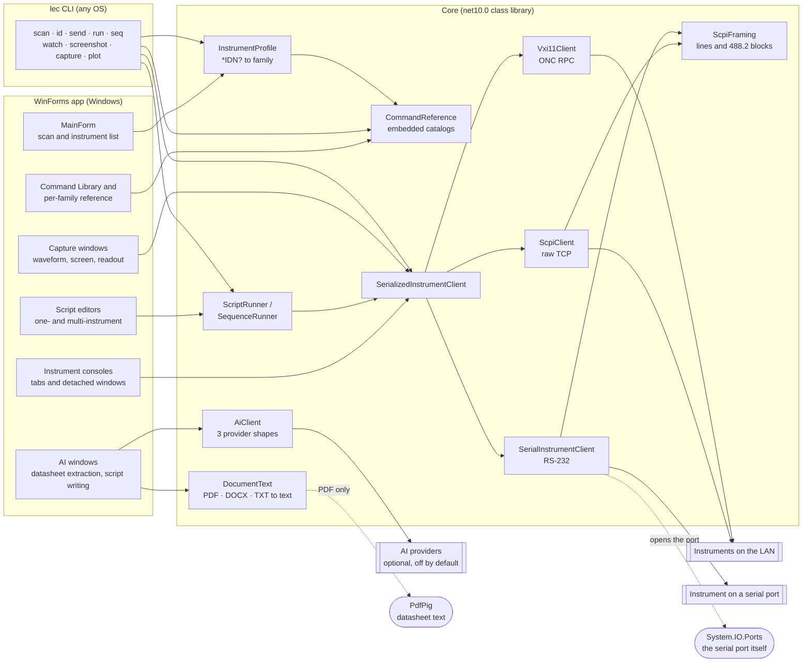
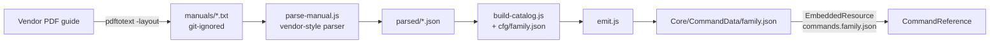
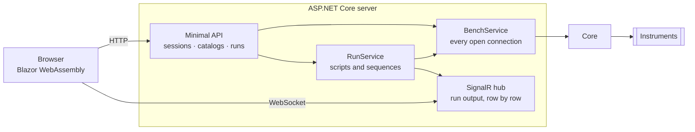

# Architecture

How Lab Equipment Controller is put together: the windows, the transport stack under
them, the catalog pipeline beside them, and the tests that hold the three to their word.
[SPEC.md](SPEC.md) says what the software must do; this document says how the pieces
do it. One rule shapes everything and is worth stating before any diagram: **never invent
SCPI** (SPEC §10). Every command the app offers — quick-command buttons, script examples,
reference entries — is transcribed from a vendor's own programming guide, and tests
enforce that mechanically.

## Overview

The system is five programs that share one data model:

- **The app** — a Windows Forms application (`net10.0-windows`, `Desktop/`).
  It scans the LAN for instruments, opens consoles on them, runs scripts against one
  instrument or several, captures waveforms and screenshots, and browses the command
  catalogs.
- **The CLI** — `Cli/`, the `lec` command (`net10.0`, no UI). The same operations from a
  terminal, on Windows, Linux or macOS. It exists because the GUI's platform is an
  accident of WinForms, not of the problem: a bench controller belongs on a headless box
  and inside a CI job as much as on a desktop.
- **The web version** — `Web/`, two projects: `…Web.Client` is a Blazor WebAssembly UI that
  holds no instrument logic at all, and `…Web` is an ASP.NET Core server that owns every
  socket and hosts the client's files. A browser cannot open a TCP connection to an
  instrument, which is not a limitation to work around but the shape of the design: the
  server is the only thing on the bench network, and the browser is a view of it.
- **The Core library** — `LabEquipmentController.Core` (`net10.0`, no UI dependency).
  Transports, discovery, instrument identity, the script and sequence runners, capture
  decoding, AI clients, settings. Everything the tests exercise lives here.
- **The catalog toolchain** — `tools/scpi-extract/`, a dependency-free Node pipeline
  that turns vendor PDF programming guides into the 36 curated catalogs the others
  consume. It is not part of the build; its output is committed.

Core is the reason two front ends cost so little: it holds every decision that is not
about pixels, and it may not reference a platform API. `System.Drawing` (screenshot
decoding) and DPAPI (the encrypted key store) are the two that would be convenient to
put there and both stay in the WinForms project instead. `CA1416` is an error in the CLI
build so the rule is enforced rather than remembered.

That constraint decides two visible things about the CLI. It never re-encodes a
screenshot — it writes the instrument's own bytes and corrects the file extension to
match, because the only in-box converter is Windows-only and a native imaging package
would cost the tool its portability. And it plots to **SVG**, hand-written, because SVG
is text: no library, identical output on every platform, and it opens in a browser.

The shared data model is the **catalog**: one JSON file per instrument family, 23,978
commands across 36 files, embedded into Core as resources and treated as the single
source of truth for what the app may send.

## High-Level System Architecture



The dependency direction is strict: both front ends reference Core; Core references
neither. The toolchain sits outside all three and meets them only at
`Core/CommandData/`.

**Core carries two external packages**, both on dotted edges, and both edges are the whole
of what they reach:

- **`PdfPig`** — `DocumentText.ReadPdf` and `PageCount`, so a datasheet the user picked can
  be sent to a provider that will not take a file upload. DOCX and TXT are read with the
  BCL alone (`System.IO.Compression`, `System.Xml.Linq`). It is not a PDF *viewer* — the
  library shows a guide through WebView2, in the desktop app only, which is why that one is
  not in Core at all.
- **`System.IO.Ports`** — opening the serial port, and nothing else; the message framing
  above it is the same `ScpiFraming` the socket uses. Microsoft's own and genuinely
  cross-platform, which is the test every candidate has to pass to be in here and the one
  WinUSB and libusb fail (SPEC §17).

Everything else in the picture is dependency-free, which is what lets the same assembly run
on Linux under the CLI and inside the container. What they cost is real and worth naming:
every consumer of the NuGet package takes both, and the Blazor client ships both to a
browser that calls neither — extraction happens on the server, and a browser has no serial
port. That is 1.83 MB gzipped for PdfPig and 10.5 KB for `System.IO.Ports`, which is why
one of those was worth a conversation and the other was not.

## Project Structure

```
LabEquipmentController/
├── Desktop/                    The WinForms app — one .cs per window (see UI Architecture)
│   ├── Program.cs              Entry point → MainForm
│   ├── Bench/                  MainForm, and the console in its tab or its own window
│   ├── Scripting/              Both editors, the colouriser, snippets, the language reference
│   ├── Ai/                     The three AI windows, the connection book, the DPAPI key store
│   ├── Catalogs/               The command library, and one family's reference
│   ├── Capture/                Waveform, screen, and the timed meter readout
│   ├── Results/                The recorded table and its plot
│   ├── Ui/                     ButtonStyle, AppIcons, SplitLayout, About — the shared chrome
│   ├── Assets/icons/           Button glyphs, embedded into the executable
│   └── installer/              Inno Setup script + its install/launch/uninstall smoke test
├── Cli/                        The `lec` command — any OS, no UI
│   ├── Program.cs              Verb dispatch, Ctrl+C, exit codes
│   ├── Endpoint.cs             A parsed address → a client to talk to it with
│   ├── Capture.cs              Image format sniffing, CSV reading, interval parsing
│   ├── Verbs/                  The verbs themselves, and the argument grammar behind them
│   └── Output/                 Table, CSV and JSON shapes; SVG plots; --stream's row pump
├── Core/                       Same areas as Tests/, so a file and its tests sit under the
│   │                           same word. Namespaces stay flat — see below
│   ├── AppInfo.cs              Version, licence and repository, read off the assembly
│   ├── Transport/              All three clients and the framing they share, the
│   │                           serializer, addresses, deadlines, sessions
│   ├── Discovery/              Subnet sweep, host ranges, CSV export, *IDN? → family
│   ├── Catalogs/               Loading the embedded catalogs, SCPI syntax, guide lookup
│   ├── Capture/                IEEE 488.2 blocks, the five waveform dialects, the zoom view
│   ├── Scripting/              Both runners, the language, its examples and guide
│   ├── Results/                Recorded series, plot arithmetic, unit guessing
│   ├── Settings/               UserSettings and where it is stored
│   ├── Ai/                     Provider clients, extraction, script author
│   └── CommandData/            The 36 curated catalogs (embedded resources)
├── Tests/                      xUnit suite (1,807 tests) against a fake instrument, one
│   │                           folder per area: Ai, Catalogs, Capture, Transport,
│   │                           Discovery, Scripting, Results, Settings, Cli, Web
│   └── Bench/                  Tests that drive the real bench, off unless LEC_BENCH=1
├── tools/scpi-extract/         Manual → catalog pipeline (Node, no dependencies)
│   ├── parse-manual.js         Fourteen vendor-layout parsers behind one dispatch
│   ├── build-catalog.js        Config-driven build + validation gates
│   ├── emit.js                 Writes the final catalog JSON
│   ├── tests.js                37 checks pinning parser behaviours that regressed once
│   └── cfg/                    One committed recipe per rebuildable catalog (25 today)
├── Web/                        The browser version
│   ├── LabEquipmentController.Web/         Server: API, SignalR hub, owns every socket
│   ├── LabEquipmentController.Web.Client/  Blazor WebAssembly UI, no instrument logic
│   └── Dockerfile              Multi-stage; docker-compose.yml sits at the repo root
├── docs/                       SPEC.md, UI-SPEC.md, this file, VERIFYING-COMMANDS.md
└── datasheets/                 Local vendor guides; indexes committed, PDFs never
```

**Folders group; namespaces do not.** Every type in Core stays in `LabEquipmentController`
however deep its folder, and the same in the app — a deliberate split, for two reasons that
outrank tidiness. Core ships as a NuGet package, so `LabEquipmentController.ScpiClient` is
public API and a folder-shaped namespace would break every consumer to no one's benefit.
And `--filter FullyQualifiedName~…`, which is how the bench suite is gated and how anyone
runs part of the tests, keys on the namespace: moving files would silently change what
those filters select. An IDE may suggest matching the two; decline it.

## The Catalog Pipeline

Catalogs are built offline and committed; **no catalog is ever parsed out of a PDF by the
app**. The one place it does read a PDF is the opposite direction — a datasheet the user
picked, read for a model to look at, whose output is quarantined from these catalogs by
design (§11b).



### Responsibilities

- **`parse-manual.js`** reads one text dump and emits `{syntax, description, example}`
  entries. Every vendor lays its guide out differently — Rigol's `Syntax:` labels,
  Chroma's colon-closed label blocks, R&S's heading-and-`Usage:` pages, Tektronix's
  wrapped headers — so the file is fourteen parsers behind one style switch, each grown
  against the failures of a real manual. The comments in that file are a catalog of
  typesetting accidents: wrapped parameter clauses, mid-token line breaks, floated
  columns, dotted contents leaders, boilerplate annexes.
- **`build-catalog.js`** applies a committed config: which parsed files to take, what to
  exclude by name, curated IEEE 488.2 supplements, an optional `restrictTo` index check
  against the guide's own command list, and validation gates (length caps, malformed-
  syntax rejection, description-quality drops).
- **`emit.js`** writes the final file with the guide's metadata block.

### The reproducibility discipline

A catalog is only called *reproducible* when building it **without** any merge against
the shipped file, then diffing, yields the shipped file — every missing and extra entry
enumerated and judged against the guide. 25 of the 36 catalogs have such a config today;
the toolchain README's rebuild table records, per remaining catalog, exactly how far the
current parser gets and why. Parser changes are held to a regression bar: every manual
whose catalog is adopted must re-parse byte-identically, and any delta on the others is
enumerated before it lands. `tests.js` pins 37 parser behaviours that regressed — or
nearly did — while the catalogs were being built.

## The web version



Three decisions are worth naming, because each is a place the desktop app's answer does not
transfer.

**Connections belong to the server, not to a browser tab.** `BenchService` is a singleton
holding one session per instrument. Two people with the page open are looking at one bench,
and a second socket to an instrument that permits one conversation would break both of
them — the same reasoning as `SerializedInstrumentClient` one layer down, applied a layer
up. It also means a twenty-minute sweep survives a refresh, which the desktop app cannot
offer at all.

**Runs stream rather than block.** Starting a script returns a run id immediately and the
output arrives over SignalR. Holding an HTTP request open for the length of a measurement
would break on every proxy in between and would give the user nothing to watch meanwhile.
Runs are cancellable by id, so Stop means stop.

**The AI key is server-side and shared.** There is no DPAPI in a Linux container, and a
per-user key store would need accounts this app does not have. The key comes from
configuration and is never sent to the browser — but anyone who can open the page can spend
it, and the UI says so.

Discovery is why the compose file uses host networking: a subnet sweep from inside Docker's
default bridge scans the container's own private network, finds nothing, and reports an
empty bench with no hint as to why. That mode is Linux-only, and
[Web/README.md](../Web/README.md) says what to do on Docker Desktop instead.

## Runtime Internals

### Transports

Three wire protocols hide behind one interface, `IInstrumentClient`:

- **`ScpiClient`** — a raw TCP socket (typically port 5025). A command containing `?` is
  a query: write, then read one line back. Anything else is fire-and-forget.
- **`Vxi11Client`** — VXI-11 for instruments that don't speak raw sockets. The session
  asks the RPC portmapper (TCP 111) for the core program's port — dynamic, never
  hard-coded — then `create_link` → `device_write`/`device_read` → `destroy_link`.
- **`SerialInstrumentClient`** — SCPI over RS-232, `COM3` or `/dev/ttyUSB0`, at the line
  settings the address named. A short file, and that is the point: SCPI over serial is
  line-based in exactly the way SCPI over a socket is. What it does not share is what a
  serial port genuinely does differently — settings that must match before a character
  gets through, a terminator that is not always LF, no connection whose closing hands the
  front panel back (so `SYSTem:LOCal` is sent instead), and a gap-between-bytes timeout on
  binary reads rather than a total one, because a screenshot at 9600 baud takes minutes and
  is not late. SPEC §13.
- **`ScpiFraming`** is the part the socket and the serial port have in common: writing a
  command, reading a line, reading an IEEE 488.2 block. Internal, and shared rather than
  copied, because it is where the careful decisions live — a reply that never reached its
  terminator throws instead of handing back the fragment (`+8.39` for `+8.39319298E-04` is
  a plausible voltage and would be plotted as one), and a block is read by its declared
  length rather than until a pause. It is also what makes the serial path testable without
  a serial port: a stream is a stream.
- **`VisaResource`** parses VISA-style strings (`TCPIP0::host::inst0::INSTR` → VXI-11,
  `TCPIP0::host::5025::SOCKET` → raw socket, `ASRL3::INSTR` → serial) so an address book
  entry chooses its own transport. A `GPIB` or `USB` resource string is refused **by name**
  rather than falling through to be read as a hostname.
- **`InstrumentAddress`** is the whole of what a person may type — a resource string,
  `vxi://host`, `tcp://host`, `serial://COM3?baud=115200`, `host:port`, or a bare host —
  and it is in Core because all three front ends must agree about what a typed address
  means. They had not: the CLI and the web server each carried the same parser and the
  desktop carried none, so its Address box refused a spelling UI-SPEC §3.3 says that box
  takes. `CreateClient` lives here too, for the same reason one parser does: each front end
  had its own switch from transport to client, and the desktop's dropped the device name,
  so a typed `vxi://host/gpib0,9` connected to the gateway rather than the instrument
  behind it.
- **`SerializedInstrumentClient`** wraps any of them and admits one exchange at a time,
  queueing the rest. VXI-11 is ONC RPC — every call writes a request record and reads
  its reply off the same stream — so two overlapping exchanges would interleave records
  and corrupt both. The UI, the runners and the pollers all share connections through
  this wrapper.
- **`Deadline`** gives every operation a timeout while keeping "it timed out" and "it
  failed" apart.

### Discovery

`NetworkScanner` sweeps a host range (`HostRange` parses `192.168.1.1-254` and CIDR
forms), probing each address for the transports above and asking `*IDN?`. Results carry
model, serial and firmware, export to RFC 4180 CSV (`ScanResultExport`), and feed the
main window's instrument list.

`SerialScanner` is its counterpart over RS-232, and splits in two what a subnet sweep does
in one. `List()` enumerates the machine's ports and opens none of them — that is what the
card shows on arrival, and it is already enough to pick one and connect. `ScanAsync()`
opens the ports it is given, at the baud rates it is given, in order, stopping at the first
that answers; it sweeps nothing else, because parity and framing are a combinatorial search
against hardware that cannot say "wrong number". Two differences from the network sweep
fall out of a port being a thing rather than an address: every port comes back whether or
not it answered, and a reply is checked before it is believed — TCP delivers the sender's
bytes or nothing, a UART at the wrong rate delivers different ones. `SerialDevice` carries
the three states that follow (not asked, asked and silent, answered with noise) and exports
under its own CSV header, because a file headed "IP Address" over a column of COM3 would be
a worse lie than a second header.

### Identity and profiles

`InstrumentProfile` maps an `*IDN?` reply to one of **37 instrument families** (36
catalogued plus `Generic`) and to the family's quick-command buttons — the model-prefix
classifier is a long, deliberate `switch` with the awkward cases called out (an FSPN
phase-noise analyzer is *not* an FSP; an FSEB30 stays Generic because no FSE *catalog*
has been built — the guide has since been found, see Future Improvements). Each family's
buttons send only commands from that family's catalog;
`ScpiSyntax` exists so tests can check that mechanically — quick commands, script
examples and capture sequences are all matched against the catalogs, template against
syntax, so SPEC §10 stays true as the catalogs grow.

### Consoles and sessions

Each discovered instrument can open a console — a tab in the main window or a detached
`InstrumentWindow`. `InstrumentSession` holds one console's history with Up/Down recall.
The console is deliberately thin: a line in, a line back, through the same serialized
client everything else uses.

### Scripting and sequences

Two runners share one small line-oriented language (SPEC §9): SCPI lines (a `?` makes it
a query), comments, `DELAY`/`WAIT`, `PRINT`/`ECHO`/`LOG`, and nestable `REPEAT n … END`.
Scripts stop on the first command error, honour cancellation between every line, and are
capped at a million instructions.

- **`ScriptRunner`** drives one instrument. The editor (`ScriptEditor`) colours tokens
  via `ScriptLanguage`, offers completion from the instrument's own catalog, and bundles
  examples (`ScriptExamples`) that match the family — a multimeter is never offered
  `C1:BSWV`.
- **`SequenceRunner`** is the same language plus the multi-instrument forms: `DEVICE
  alias : MODEL` binds a name to a discovered instrument, `WITH alias … END` scopes
  lines to it, `COLUMNS` declares the table a run records into. Interleaved measurements
  — set the generator, wait, read the meter, repeat — live here because a single-
  instrument script cannot express them.

Runs record into `ReadingSeries` and plot through `ResultPlot`; `MeasurementUnit`
guesses a column's unit from its name and values so axes label themselves.

### Capture

Bulk data comes back as IEEE 488.2 binary blocks (`Ieee4882Block`). For scope traces,
`WaveformDialect` encodes the uncomfortable truth that every vendor does this
differently — different command trees, different preamble formats, different arithmetic
from raw bytes to volts — and `WaveformReader` runs the right dialect, with every
command it sends present in that family's catalog and covered by tests. Screenshots use
each family's documented `HCOPy`/`DISPlay` sequence. `WaveformView` handles zooming as
fractions of the record, and `WaveformCapture` holds the decoded samples.

### AI features (optional, off by default)

Three features call a language model; none of them touches the curated catalogs:

- **Datasheet extraction** (`CommandExtractor`): reads a local guide (`DocumentText`
  extracts text from PDF/DOCX/TXT itself, no service upload of the file — **PdfPig** for the
  PDF path, the BCL for the other two), asks the model for commands, and stores the result
  in a separate `ExtractedCatalogStore` — extracted commands are quarantined from the
  curated references by design, reviewable in the UI.
- **Script writing** (`ScriptAuthor`): drafts a script from a request, then checks every
  drafted command against the instrument's catalog and flags what isn't there. It is a
  conversation — earlier turns go into the payload as a transcript, so a follow-up like
  "now do the same at 5 V" is answerable, and a header the check rejected last turn is
  carried back so it does not come round again. A transcript rather than the provider's own
  multi-turn message array: three providers spell that array three ways, and this keeps the
  catalogs out of every historical turn. Nothing trims it; the window that holds the
  conversation shows what it costs and offers a Clear.
- **`AiClient`** speaks three request shapes — Gemini's Interactions API, the Anthropic
  Messages API, and OpenAI-compatible `chat/completions` (OpenAI, OpenRouter, Groq,
  local servers) — selected per connection in `AiConnection`. Request building and reply
  parsing live in `AiRequest`, testable without a network. Keys are held by
  `SecretStore` under Windows DPAPI, per user, never in a file in the repo.

## Data Model: a catalog

One JSON file per family. The header says where every entry came from; the entries are
the guide's own words.

| Field | Meaning |
|---|---|
| `instrument` | Human name and models, e.g. `"Digital multimeter (Rigol DM3058 / DM3058E)"` |
| `source` | Provenance prose: which guide, what was included and excluded, and why |
| `manufacturer` | The badge on the instrument |
| `guide` | `{ title, edition, vendor, url, fileName }` — enough to find the exact document |
| `commands[]` | The entries |

Each command:

| Field | Meaning |
|---|---|
| `category` | The guide's own chapter/subsystem grouping |
| `syntax` | The command with its parameter clause, as the guide prints it |
| `description` | The guide's sentence, not a paraphrase |
| `example` | Present when the guide gives one |
| `isQuery` | Present and `true` on query forms |
| `benchVerified` | Present and `true` on the 518 entries confirmed against real hardware |
| `crossChecked` | Present and `true` where an independent open-source driver uses the same header |
| `guideMisprint` | On an entry transcribing a vendor typo as printed: what the guide prints, why it looks wrong, what to try |

```json
{ "category": "IEEE 488.2 Common", "syntax": "*IDN?",
  "description": "Identify the instrument: manufacturer, model, serial number, firmware version.",
  "example": "*IDN?", "isQuery": true, "benchVerified": true }
```

Catalogs embed into Core as `commands.<family>.json`; `CommandReference` loads them on
demand and a freshness test byte-compares every embedded resource against the file on
disk, so a stale build cannot quietly ship an old catalog.

## UI Architecture

`Program.cs` starts `MainForm`, and every other window hangs off it:

| Window | Role |
|---|---|
| `MainForm` | Scan controls, the discovered-instruments list, console tabs |
| `InstrumentWindow` / `InstrumentConsole` | A console per instrument; tabs detach into windows |
| `CommandLibraryForm` | Browse and search all 36 catalogs at once |
| `CommandReferenceForm` | One family's curated reference beside its console |
| `ScriptForm` (+ `ScriptEditor`, `SnippetMenu`, `ScriptReferenceForm`) | Single-instrument scripts: coloured editor, completion, examples, language reference |
| `SequenceForm` | Multi-Instrument Scripts: the `.seq` editor, device binding, the results table |
| `ResultsPanel` / `ResultPlotPanel` | Recorded readings and their plot with axis pickers |
| `WaveformForm` / `ScreenCaptureForm` / `MultimeterReadoutForm` | Scope traces, instrument screenshots, a live meter readout |
| `ScriptAiForm` / `DatasheetExtractForm` / `AiSettingsForm` | The three AI surfaces: drafting, extraction review, provider setup |

UI conventions — window sizing, the shared `ButtonStyle` metrics, `AppIcons` glyphs,
`SplitLayout` — are SPEC §14's department; the forms hold no instrument logic beyond
calling Core.

## Testing

Two suites, two languages, one philosophy: a guard that isn't mechanical will not hold.

- **`Tests/` (xUnit, 1,807 tests)** runs against `FakeInstrumentClient` — no hardware.
  One folder per area — Ai, Catalogs, Capture, Transport, Discovery, Scripting, Results,
  Settings, Cli, Web — with the shared fake at the root; the namespaces stay flat, so
  every `--filter FullyQualifiedName~…` habit still selects what it always did.
  The catalog guards are the backbone: every quick command and example exists in its
  family's catalog (`CatalogCoverageTests`), no entry is a truncated line, no invented
  query survives (`GuideMisprintTests` pins the known vendor misprints), embedded
  resources match disk (`EmbeddedCatalogFreshnessTests`), profiles classify the SPEC §8
  table exactly (`InstrumentProfileTests`). Around them: protocol tests (VXI-11 framing,
  IEEE blocks, waveform dialect arithmetic), runner threading, and the AI request
  shapes.
- **`Tests/Bench/`** drives the real bench — three instruments — and stays off unless
  `LEC_BENCH=1`, so CI and contributors run green without hardware. Bench runs are where
  `benchVerified` ticks come from.
- **`tools/scpi-extract/tests.js`** (37 checks, `node tests.js`, two seconds) guards the
  toolchain itself, one case per parser behaviour that once regressed.

## Distribution

Five shapes from one tree. What separates them is who is expected to already have a .NET
runtime, and whether the thing being shipped has a user interface at all:

| Shape | Build | Size | For |
|---|---|---:|---|
| Portable zip | self-contained single-file (`-p:PublishProfile=win-x64`) | ~46 MB | A machine with no .NET, or no wish to install one — unzip and run |
| `setup.exe` | framework-dependent single-file, wrapped by Inno Setup | ~4 MB | Everyone else: per-user install, Start Menu entry, uninstaller |
| `lec` | framework-dependent single-file, per RID | ~11 MB | Any OS. Publish per target: `-r linux-x64`, `osx-arm64`, `win-x64`, … |
| `LabEquipmentController` on NuGet | `dotnet pack` of the Core project | ~757 KB | Somebody else's program. The library alone — transports, catalogs, runners — with no UI |
| `…/labequipmentcontroller-web` on Docker Hub | `Web/Dockerfile`, multi-stage | ~68 MB over `aspnet:10.0` | A bench server. The browser build, `amd64` and `arm64` |

Of that ~68 MB the Blazor client is 42 MB and the server 26 MB — the client half is large
because a WebAssembly publish ships each asset uncompressed *and* Brotli-compressed, and the
server serves whichever the browser asked for.

The container is the one shape built for two architectures, and it gets them for almost
nothing. The publish is framework-dependent and RID-agnostic, so the IL in `/app` is
architecture-neutral, and the single genuinely native dependency — `System.IO.Ports`' serial
shim — arrives from NuGet as every RID at once, resolved at process start. So the Dockerfile
pins only its *build* stage to `$BUILDPLATFORM`: one amd64 build, two images, no emulation
for anything but the runtime stage's `mkdir`. A `-r` on that publish would end this.

The package id deliberately drops the `.Core` suffix its assembly carries, so it does not
read as a .NET Core component; the assembly keeps the name because the WinForms
executable already owns `LabEquipmentController.exe`, and two assemblies cannot share
one. The catalogs travel inside the assembly as embedded resources, which is why a 5.9 MB
DLL compresses into a 757 KB package and why a consumer needs no content files on disk.

Only the GUI is Windows-only, and only because WinForms is. On Linux and macOS the CLI
and test projects are built directly rather than through the solution, which still
contains the WinForms app.

The installer's payload cannot start without the .NET 10 Desktop Runtime, so the script
checks for a `10.x` directory under `Microsoft.WindowsDesktop.App` before installing and
offers to fetch it from Microsoft's permalink when it is absent — the 9.x runtime an
earlier release of this app may have installed does not satisfy it, which is the trap that
check exists to catch. It
installs per-user (no UAC; the app needs no elevation) with a machine-wide option.
`Desktop/installer/Test-Installer.ps1` drives a real install, launches the installed app to prove
the payload resolves its runtime, uninstalls, and checks the machine came back clean.

## Strengths and Limitations

**Strengths.** Provenance is the product: every command traces to a named guide, 24 of
36 catalogs rebuild from committed recipes, and the never-invent-SCPI rule is enforced
by tests rather than by care. The transport layer respects the protocols' actual rules
(dynamic VXI-11 ports, serialized exchanges). The toolchain's parsers are grown against
real manuals and pinned by tests, so a parser fix cannot silently un-fix another
vendor's catalog.

**Limitations.** The UI is Windows-only (the Core library is not). Transports are LAN and
RS-232 — no USB-TMC and no GPIB, and not for the same reason each: GPIB cannot be reached
without the vendor driver this project refuses, while USBTMC would need a system library
the user must already have (libusb) and, on Windows, a driver bound to the device by hand.
SPEC §17 has the whole argument; nothing is planned. Serial was on that list too and is
not any more — it turned out to cost what §17 predicted it would. **Discovery works
differently there**: a serial port cannot be swept the way an address can, so the two
halves a subnet sweep runs together are split. Listing the ports opens nothing and happens
on arrival; opening them is `Scan`, over the ports chosen and the baud rates named, and
nothing else is ever tried. Eleven catalogs cannot yet be rebuilt from their
guides (documented per-catalog in the toolchain README), and 518 of 23,978 entries have
bench confirmation — the rest are transcription, which is exactly what
[VERIFYING-COMMANDS.md](VERIFYING-COMMANDS.md) invites contributors to change.

## Future Improvements

The live list is in the toolchain README and SPEC §17. Three standing items are now closed:
the `rohde-power-supply` catalog no longer ships old-parse junk, and no description stops
mid-sentence in any catalog.

**The FSIQ has left `Generic`.** Its Operating Manual (1119.5063.12) was found, and the
catalog built from it carries 1,051 commands — a first extraction, with no adoption pass yet
and its known weaknesses written into the catalog's own `source` field.

**The FSE has not, and the reason is worth recording.** Its Operating Manual was found too,
but the copy is **Volume 1**, and chapter 6 — the command reference — is in Volume 2. Reading
Volume 1 produces 1,263 plausible-looking entries whose descriptions are page footers
("1065.6016.12 4.134 E-15 FSE Search Functions") and softkey prose, and which are missing
`FREQuency:CENTer` entirely. That catalog was built, inspected and deleted rather than
shipped. An FSEB30 still comes out `Generic`, correctly: half a guide is not a guide.

**The Chroma 63800 guide has been found and cannot be used.** Its only surviving copy is a
Wayback capture of a Transcat mirror, and that 44 MB PDF is a scan: `pdftotext` recovers 550
bytes from it, all of them the cover. It is the right document — "Programmable AC/DC
Electronic Load 63800 Series Operation & Programming Manual, Version 1.1, April 2009" — but
without an OCR pass there is nothing for the extractor to read, and OCR of a 2009 scan is
not a transcription anyone should trust unreviewed.

Also standing: adoption passes for the nearest non-rebuildable catalogs (Rigol DSA800,
R&S FSV). The catalogs that rebuild but differ are not on the list: "differs" is extraction
minus curation, the expected state (SPEC §10), and anything genuine a re-read turns up is
adopted entry by entry rather than re-emitted.

## End-to-End Example

The bundled *filter frequency response* sequence, from power-on to plot:

1. **Scan.** `MainForm` → `NetworkScanner` sweeps the bench subnet; a Siglent SDG2042X
   and a Rigol DS2202 answer `*IDN?`.
2. **Classify.** `InstrumentProfile` maps the replies to `SiglentGenerator` and
   `Oscilloscope`; each console gets its family's quick commands and catalog.
3. **Bind.** The sequence's `DEVICE gen : SDG2042X` and `DEVICE scope : DS2202` lines
   resolve against the discovered list; `SequenceRunner` holds one serialized client
   per alias.
4. **Run.** Inside `REPEAT`, the script sets `C1:BSWV FRQ,<f>` on `gen`, waits for the
   filter to settle, queries the scope's Vrms, and records `Frequency, Vout` into the
   `COLUMNS` table — two instruments alternating inside one loop.
5. **See.** `ResultsPanel` fills row by row; `ResultPlotPanel` plots Vout over
   frequency, `MeasurementUnit` labelling the axes from the column names. Export is a
   CSV.

Every SCPI line in that story — the quick commands, the sequence's lines, the scope
query — exists in a committed catalog, transcribed from the two vendors' guides, and a
test checked that before the code ever ran.
