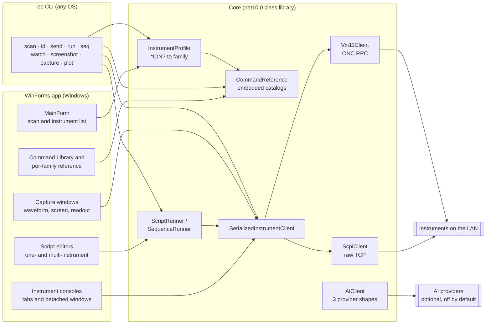
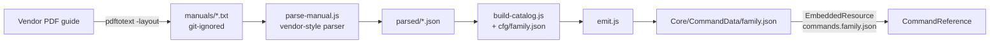
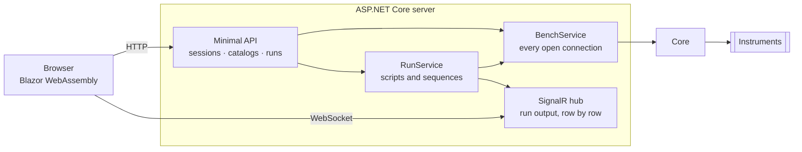

# Architecture

How Lab Equipment Controller is put together: the windows, the transport stack under
them, the catalog pipeline beside them, and the tests that hold the three to their word.
[SPEC.md](SPEC.md) says what the software must do; this document says how the pieces
do it. One rule shapes everything and is worth stating before any diagram: **never invent
SCPI** (SPEC §10). Every command the app offers — quick-command buttons, script examples,
reference entries — is transcribed from a vendor's own programming guide, and tests
enforce that mechanically.

## Overview

The system is five programs that share one data model:

- **The app** — a Windows Forms application (`net10.0-windows`, the repository root).
  It scans the LAN for instruments, opens consoles on them, runs scripts against one
  instrument or several, captures waveforms and screenshots, and browses the command
  catalogs.
- **The CLI** — `Cli/`, the `lec` command (`net10.0`, no UI). The same operations from a
  terminal, on Windows, Linux or macOS. It exists because the GUI's platform is an
  accident of WinForms, not of the problem: a bench controller belongs on a headless box
  and inside a CI job as much as on a desktop.
- **The web version** — `Web/`, two projects: `…Web.Client` is a Blazor WebAssembly UI that
  holds no instrument logic at all, and `…Web` is an ASP.NET Core server that owns every
  socket and hosts the client's files. A browser cannot open a TCP connection to an
  instrument, which is not a limitation to work around but the shape of the design: the
  server is the only thing on the bench network, and the browser is a view of it.
- **The Core library** — `LabEquipmentController.Core` (`net10.0`, no UI dependency).
  Transports, discovery, instrument identity, the script and sequence runners, capture
  decoding, AI clients, settings. Everything the tests exercise lives here.
- **The catalog toolchain** — `tools/scpi-extract/`, a dependency-free Node pipeline
  that turns vendor PDF programming guides into the 35 curated catalogs the others
  consume. It is not part of the build; its output is committed.

Core is the reason two front ends cost so little: it holds every decision that is not
about pixels, and it may not reference a platform API. `System.Drawing` (screenshot
decoding) and DPAPI (the encrypted key store) are the two that would be convenient to
put there and both stay in the WinForms project instead. `CA1416` is an error in the CLI
build so the rule is enforced rather than remembered.

That constraint decides two visible things about the CLI. It never re-encodes a
screenshot — it writes the instrument's own bytes and corrects the file extension to
match, because the only in-box converter is Windows-only and a native imaging package
would cost the tool its portability. And it plots to **SVG**, hand-written, because SVG
is text: no library, identical output on every platform, and it opens in a browser.

The shared data model is the **catalog**: one JSON file per instrument family, 23,174
commands across 35 files, embedded into Core as resources and treated as the single
source of truth for what the app may send.

## High-Level System Architecture



The dependency direction is strict: both front ends reference Core; Core references
neither. The toolchain sits outside all three and meets them only at
`Core/CommandData/`.

## Project Structure

```
LabEquipmentController/
├── *.cs                        The WinForms app: one file per window (see UI Architecture)
├── Program.cs                  Entry point → MainForm
├── Cli/                        The `lec` command — any OS, no UI
│   ├── Program.cs              Verb dispatch, Ctrl+C, exit codes
│   ├── CommandLine.cs          Argument grammar and the usage text
│   ├── Endpoint.cs             An address string → transport + client
│   ├── Commands.cs             The verbs: scan · id · send · run · seq · watch · …
│   ├── Capture.cs              Image format sniffing, CSV reading, interval parsing
│   ├── Plot.cs                 Hand-written SVG charts — no imaging dependency
│   ├── RowStream.cs            --stream: rows out as they happen, flushed
│   └── Output.cs               Table, CSV and JSON shapes
├── Core/
│   ├── ScpiClient.cs           Raw-socket SCPI: '?' → query+read, else write
│   ├── Vxi11Client.cs          VXI-11 over ONC RPC (portmapper → core channel)
│   ├── SerializedInstrumentClient.cs   One exchange at a time per connection
│   ├── VisaResource.cs         TCPIP resource strings → transport choice
│   ├── NetworkScanner.cs       Subnet sweep; HostRange.cs; ScanResultExport.cs
│   ├── InstrumentProfile.cs    *IDN? → 1 of 36 families → quick commands
│   ├── CommandReference.cs     Loads the embedded catalogs
│   ├── CommandDiscovery.cs     Probes what an unknown instrument answers
│   ├── ScriptRunner.cs         The §9 script language, one instrument
│   ├── SequenceRunner.cs       The §9a language: DEVICE/WITH across instruments
│   ├── WaveformDialect.cs      Per-vendor trace commands and scaling arithmetic
│   ├── WaveformReader.cs       Capture → samples, catalog-checked commands only
│   ├── Ieee4882Block.cs        IEEE 488.2 binary block parsing
│   ├── Ai/                     Provider clients, extraction, script author
│   └── CommandData/            The 35 curated catalogs (embedded resources)
├── Tests/                      xUnit suite (1,188 tests) against a fake instrument
│   └── Bench/                  Tests that drive the real bench, off unless LEC_BENCH=1
├── tools/scpi-extract/         Manual → catalog pipeline (Node, no dependencies)
│   ├── parse-manual.js         Fourteen vendor-layout parsers behind one dispatch
│   ├── build-catalog.js        Config-driven build + validation gates
│   ├── emit.js                 Writes the final catalog JSON
│   ├── tests.js                36 checks pinning parser behaviours that regressed once
│   └── cfg/                    One committed recipe per rebuildable catalog (24 today)
├── Web/                        The browser version
│   ├── LabEquipmentController.Web/         Server: API, SignalR hub, owns every socket
│   ├── LabEquipmentController.Web.Client/  Blazor WebAssembly UI, no instrument logic
│   └── Dockerfile              Multi-stage; docker-compose.yml sits at the repo root
├── installer/                  Inno Setup script + its install/launch/uninstall smoke test
├── docs/                       SPEC.md, this file, VERIFYING-COMMANDS.md
└── datasheets/                 Local vendor guides; indexes committed, PDFs never
```

## The Catalog Pipeline

Catalogs are built offline and committed; the app never parses a PDF.



### Responsibilities

- **`parse-manual.js`** reads one text dump and emits `{syntax, description, example}`
  entries. Every vendor lays its guide out differently — Rigol's `Syntax:` labels,
  Chroma's colon-closed label blocks, R&S's heading-and-`Usage:` pages, Tektronix's
  wrapped headers — so the file is fourteen parsers behind one style switch, each grown
  against the failures of a real manual. The comments in that file are a catalog of
  typesetting accidents: wrapped parameter clauses, mid-token line breaks, floated
  columns, dotted contents leaders, boilerplate annexes.
- **`build-catalog.js`** applies a committed config: which parsed files to take, what to
  exclude by name, curated IEEE 488.2 supplements, an optional `restrictTo` index check
  against the guide's own command list, and validation gates (length caps, malformed-
  syntax rejection, description-quality drops).
- **`emit.js`** writes the final file with the guide's metadata block.

### The reproducibility discipline

A catalog is only called *reproducible* when building it **without** any merge against
the shipped file, then diffing, yields the shipped file — every missing and extra entry
enumerated and judged against the guide. 24 of the 35 catalogs have such a config today;
the toolchain README's rebuild table records, per remaining catalog, exactly how far the
current parser gets and why. Parser changes are held to a regression bar: every manual
whose catalog is adopted must re-parse byte-identically, and any delta on the others is
enumerated before it lands. `tests.js` pins 36 parser behaviours that regressed — or
nearly did — while the catalogs were being built.

## The web version



Three decisions are worth naming, because each is a place the desktop app's answer does not
transfer.

**Connections belong to the server, not to a browser tab.** `BenchService` is a singleton
holding one session per instrument. Two people with the page open are looking at one bench,
and a second socket to an instrument that permits one conversation would break both of
them — the same reasoning as `SerializedInstrumentClient` one layer down, applied a layer
up. It also means a twenty-minute sweep survives a refresh, which the desktop app cannot
offer at all.

**Runs stream rather than block.** Starting a script returns a run id immediately and the
output arrives over SignalR. Holding an HTTP request open for the length of a measurement
would break on every proxy in between and would give the user nothing to watch meanwhile.
Runs are cancellable by id, so Stop means stop.

**The AI key is server-side and shared.** There is no DPAPI in a Linux container, and a
per-user key store would need accounts this app does not have. The key comes from
configuration and is never sent to the browser — but anyone who can open the page can spend
it, and the UI says so.

Discovery is why the compose file uses host networking: a subnet sweep from inside Docker's
default bridge scans the container's own private network, finds nothing, and reports an
empty bench with no hint as to why. That mode is Linux-only, and the README says what to do
on Docker Desktop instead.

## Runtime Internals

### Transports

Two wire protocols hide behind one interface, `IInstrumentClient`:

- **`ScpiClient`** — a raw TCP socket (typically port 5025). A command containing `?` is
  a query: write, then read one line back. Anything else is fire-and-forget. Line-based
  reads only; binary blocks are the capture path's job.
- **`Vxi11Client`** — VXI-11 for instruments that don't speak raw sockets. The session
  asks the RPC portmapper (TCP 111) for the core program's port — dynamic, never
  hard-coded — then `create_link` → `device_write`/`device_read` → `destroy_link`.
- **`VisaResource`** parses VISA-style strings (`TCPIP0::host::inst0::INSTR` → VXI-11,
  `TCPIP0::host::5025::SOCKET` → raw socket) so an address book entry chooses its own
  transport.
- **`SerializedInstrumentClient`** wraps either and admits one exchange at a time,
  queueing the rest. VXI-11 is ONC RPC — every call writes a request record and reads
  its reply off the same stream — so two overlapping exchanges would interleave records
  and corrupt both. The UI, the runners and the pollers all share connections through
  this wrapper.
- **`Deadline`** gives every operation a timeout while keeping "it timed out" and "it
  failed" apart.

### Discovery

`NetworkScanner` sweeps a host range (`HostRange` parses `192.168.1.1-254` and CIDR
forms), probing each address for the transports above and asking `*IDN?`. Results carry
model, serial and firmware, export to RFC 4180 CSV (`ScanResultExport`), and feed the
main window's instrument list.

### Identity and profiles

`InstrumentProfile` maps an `*IDN?` reply to one of **36 instrument families** (35
catalogued plus `Generic`) and to the family's quick-command buttons — the model-prefix
classifier is a long, deliberate `switch` with the awkward cases called out (an FSPN
phase-noise analyzer is *not* an FSP; an FSEB30 stays Generic because no FSE guide has
been found). Each family's buttons send only commands from that family's catalog;
`ScpiSyntax` exists so tests can check that mechanically — quick commands, script
examples and capture sequences are all matched against the catalogs, template against
syntax, so SPEC §10 stays true as the catalogs grow.

### Consoles and sessions

Each discovered instrument can open a console — a tab in the main window or a detached
`InstrumentWindow`. `InstrumentSession` holds one console's history with Up/Down recall.
The console is deliberately thin: a line in, a line back, through the same serialized
client everything else uses.

### Scripting and sequences

Two runners share one small line-oriented language (SPEC §9): SCPI lines (a `?` makes it
a query), comments, `DELAY`/`WAIT`, `PRINT`/`ECHO`/`LOG`, and nestable `REPEAT n … END`.
Scripts stop on the first command error, honour cancellation between every line, and are
capped at a million instructions.

- **`ScriptRunner`** drives one instrument. The editor (`ScriptEditor`) colours tokens
  via `ScriptLanguage`, offers completion from the instrument's own catalog, and bundles
  examples (`ScriptExamples`) that match the family — a multimeter is never offered
  `C1:BSWV`.
- **`SequenceRunner`** is the same language plus the multi-instrument forms: `DEVICE
  alias : MODEL` binds a name to a discovered instrument, `WITH alias … END` scopes
  lines to it, `COLUMNS` declares the table a run records into. Interleaved measurements
  — set the generator, wait, read the meter, repeat — live here because a single-
  instrument script cannot express them.

Runs record into `ReadingSeries` and plot through `ResultPlot`; `MeasurementUnit`
guesses a column's unit from its name and values so axes label themselves.

### Capture

Bulk data comes back as IEEE 488.2 binary blocks (`Ieee4882Block`). For scope traces,
`WaveformDialect` encodes the uncomfortable truth that every vendor does this
differently — different command trees, different preamble formats, different arithmetic
from raw bytes to volts — and `WaveformReader` runs the right dialect, with every
command it sends present in that family's catalog and covered by tests. Screenshots use
each family's documented `HCOPy`/`DISPlay` sequence. `WaveformView` handles zooming as
fractions of the record, and `WaveformCapture` holds the decoded samples.

### AI features (optional, off by default)

Three features call a language model; none of them touches the curated catalogs:

- **Datasheet extraction** (`CommandExtractor`): reads a local guide (`DocumentText`
  extracts text from PDF/DOCX/TXT itself, no service upload of the file), asks the model
  for commands, and stores the result in a separate `ExtractedCatalogStore` — extracted
  commands are quarantined from the curated references by design, reviewable in the UI.
- **Script writing** (`ScriptAuthor`): drafts a script from a request, then checks every
  drafted command against the instrument's catalog and flags what isn't there.
- **`AiClient`** speaks three request shapes — Gemini's Interactions API, the Anthropic
  Messages API, and OpenAI-compatible `chat/completions` (OpenAI, OpenRouter, Groq,
  local servers) — selected per connection in `AiConnection`. Request building and reply
  parsing live in `AiRequest`, testable without a network. Keys are held by
  `SecretStore` under Windows DPAPI, per user, never in a file in the repo.

## Data Model: a catalog

One JSON file per family. The header says where every entry came from; the entries are
the guide's own words.

| Field | Meaning |
|---|---|
| `instrument` | Human name and models, e.g. `"Digital multimeter (Rigol DM3058 / DM3058E)"` |
| `source` | Provenance prose: which guide, what was included and excluded, and why |
| `manufacturer` | The badge on the instrument |
| `guide` | `{ title, edition, vendor, url, fileName }` — enough to find the exact document |
| `commands[]` | The entries |

Each command:

| Field | Meaning |
|---|---|
| `category` | The guide's own chapter/subsystem grouping |
| `syntax` | The command with its parameter clause, as the guide prints it |
| `description` | The guide's sentence, not a paraphrase |
| `example` | Present when the guide gives one |
| `isQuery` | Present and `true` on query forms |
| `benchVerified` | Present and `true` on the 518 entries confirmed against real hardware |

```json
{ "category": "IEEE 488.2 Common", "syntax": "*IDN?",
  "description": "Identify the instrument: manufacturer, model, serial number, firmware version.",
  "example": "*IDN?", "isQuery": true, "benchVerified": true }
```

Catalogs embed into Core as `commands.<family>.json`; `CommandReference` loads them on
demand and a freshness test byte-compares every embedded resource against the file on
disk, so a stale build cannot quietly ship an old catalog.

## UI Architecture

`Program.cs` starts `MainForm`, and every other window hangs off it:

| Window | Role |
|---|---|
| `MainForm` | Scan controls, the discovered-instruments list, console tabs |
| `InstrumentWindow` / `InstrumentConsole` | A console per instrument; tabs detach into windows |
| `CommandLibraryForm` | Browse and search all 35 catalogs at once |
| `CommandReferenceForm` | One family's curated reference beside its console |
| `ScriptForm` (+ `ScriptEditor`, `SnippetMenu`, `ScriptReferenceForm`) | Single-instrument scripts: coloured editor, completion, examples, language reference |
| `SequenceForm` | Multi-Instrument Scripts: the `.seq` editor, device binding, the results table |
| `ResultsPanel` / `ResultPlotPanel` | Recorded readings and their plot with axis pickers |
| `WaveformForm` / `ScreenCaptureForm` / `MultimeterReadoutForm` | Scope traces, instrument screenshots, a live meter readout |
| `ScriptAiForm` / `DatasheetExtractForm` / `AiSettingsForm` | The three AI surfaces: drafting, extraction review, provider setup |

UI conventions — window sizing, the shared `ButtonStyle` metrics, `AppIcons` glyphs,
`SplitLayout` — are SPEC §14's department; the forms hold no instrument logic beyond
calling Core.

## Testing

Two suites, two languages, one philosophy: a guard that isn't mechanical will not hold.

- **`Tests/` (xUnit, 1,188 tests)** runs against `FakeInstrumentClient` — no hardware.
  The catalog guards are the backbone: every quick command and example exists in its
  family's catalog (`CatalogCoverageTests`), no entry is a truncated line, no invented
  query survives (`GuideMisprintTests` pins the known vendor misprints), embedded
  resources match disk (`EmbeddedCatalogFreshnessTests`), profiles classify the SPEC §8
  table exactly (`InstrumentProfileTests`). Around them: protocol tests (VXI-11 framing,
  IEEE blocks, waveform dialect arithmetic), runner threading, and the AI request
  shapes.
- **`Tests/Bench/`** drives the real bench — three instruments — and stays off unless
  `LEC_BENCH=1`, so CI and contributors run green without hardware. Bench runs are where
  `benchVerified` ticks come from.
- **`tools/scpi-extract/tests.js`** (36 checks, `node tests.js`, two seconds) guards the
  toolchain itself, one case per parser behaviour that once regressed.

## Distribution

Two shapes from the same code, differing only in whether the runtime travels with them:

| Shape | Build | Size | For |
|---|---|---:|---|
| Portable zip | self-contained single-file (`-p:PublishProfile=win-x64`) | ~46 MB | A machine with no .NET, or no wish to install one — unzip and run |
| `setup.exe` | framework-dependent single-file, wrapped by Inno Setup | ~4 MB | Everyone else: per-user install, Start Menu entry, uninstaller |
| `lec` | framework-dependent single-file, per RID | ~11 MB | Any OS. Publish per target: `-r linux-x64`, `osx-arm64`, `win-x64`, … |
| `LabEquipmentController` on NuGet | `dotnet pack` of the Core project | ~757 KB | Somebody else's program. The library alone — transports, catalogs, runners — with no UI |

The package id deliberately drops the `.Core` suffix its assembly carries, so it does not
read as a .NET Core component; the assembly keeps the name because the WinForms
executable already owns `LabEquipmentController.exe`, and two assemblies cannot share
one. The catalogs travel inside the assembly as embedded resources, which is why a 5.9 MB
DLL compresses into a 757 KB package and why a consumer needs no content files on disk.

Only the GUI is Windows-only, and only because WinForms is. On Linux and macOS the CLI
and test projects are built directly rather than through the solution, which still
contains the WinForms app.

The installer's payload cannot start without the .NET 10 Desktop Runtime, so the script
checks for a `10.x` directory under `Microsoft.WindowsDesktop.App` before installing and
offers to fetch it from Microsoft's permalink when it is absent — the 9.x runtime an
earlier release of this app may have installed does not satisfy it, which is the trap that
check exists to catch. It
installs per-user (no UAC; the app needs no elevation) with a machine-wide option.
`installer/Test-Installer.ps1` drives a real install, launches the installed app to prove
the payload resolves its runtime, uninstalls, and checks the machine came back clean.

## Strengths and Limitations

**Strengths.** Provenance is the product: every command traces to a named guide, 24 of
35 catalogs rebuild from committed recipes, and the never-invent-SCPI rule is enforced
by tests rather than by care. The transport layer respects the protocols' actual rules
(dynamic VXI-11 ports, serialized exchanges). The toolchain's parsers are grown against
real manuals and pinned by tests, so a parser fix cannot silently un-fix another
vendor's catalog.

**Limitations.** The UI is Windows-only (the Core library is not). Transports are
LAN-only — no USB-TMC, GPIB or serial. `ScpiClient` is line-based by design; binary
work belongs to the capture path. Eleven catalogs cannot yet be rebuilt from their
guides (documented per-catalog in the toolchain README), and 518 of 23,174 entries have
bench confirmation — the rest are transcription, which is exactly what
[VERIFYING-COMMANDS.md](VERIFYING-COMMANDS.md) invites contributors to change.

## Future Improvements

The live list is in the toolchain README and SPEC §17; the standing items: audit and
repair the `rohde-power-supply` catalog (it ships known old-parse junk), hunt the R&S
FSE/FSIQ manuals so the last two analyzer families leave `Generic`, adoption passes for
the nearest non-rebuildable catalogs (Rigol DSA800, R&S FSV), and the Chroma 63800
guide, whose only known mirror is currently dead.

## End-to-End Example

The bundled *filter frequency response* sequence, from power-on to plot:

1. **Scan.** `MainForm` → `NetworkScanner` sweeps the bench subnet; a Siglent SDG2042X
   and a Rigol DS2202 answer `*IDN?`.
2. **Classify.** `InstrumentProfile` maps the replies to `SiglentGenerator` and
   `Oscilloscope`; each console gets its family's quick commands and catalog.
3. **Bind.** The sequence's `DEVICE gen : SDG2042X` and `DEVICE scope : DS2202` lines
   resolve against the discovered list; `SequenceRunner` holds one serialized client
   per alias.
4. **Run.** Inside `REPEAT`, the script sets `C1:BSWV FRQ,<f>` on `gen`, waits for the
   filter to settle, queries the scope's Vrms, and records `Frequency, Vout` into the
   `COLUMNS` table — two instruments alternating inside one loop.
5. **See.** `ResultsPanel` fills row by row; `ResultPlotPanel` plots Vout over
   frequency, `MeasurementUnit` labelling the axes from the column names. Export is a
   CSV.

Every SCPI line in that story — the quick commands, the sequence's lines, the scope
query — exists in a committed catalog, transcribed from the two vendors' guides, and a
test checked that before the code ever ran.
